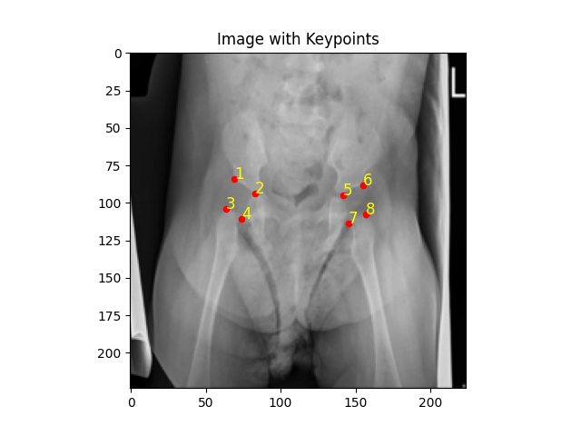
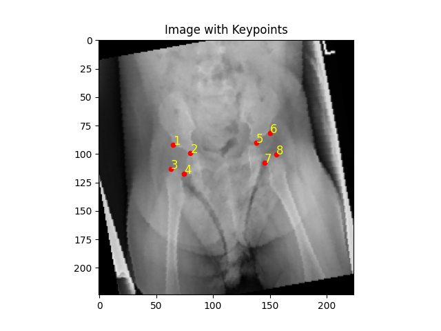
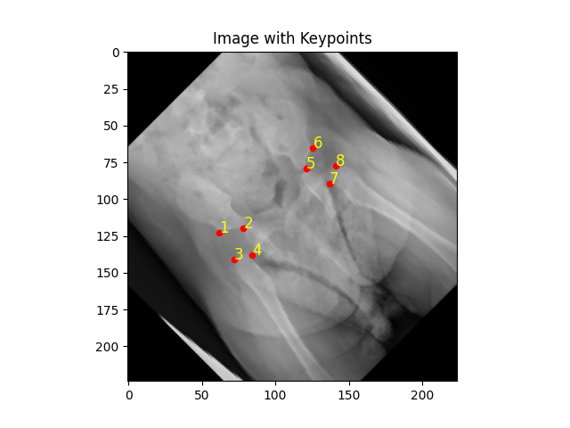
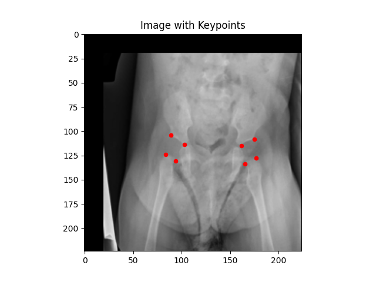
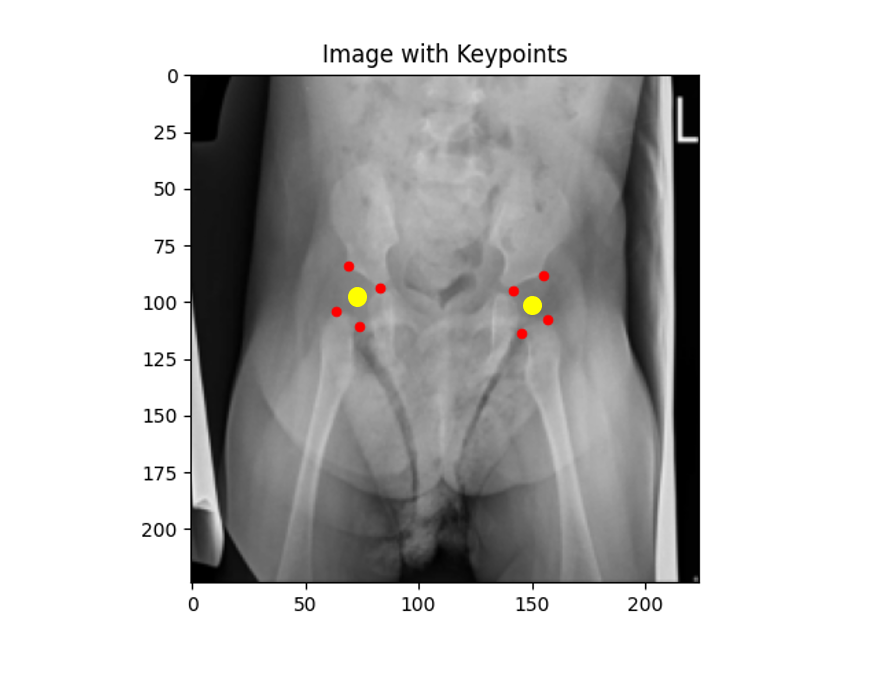
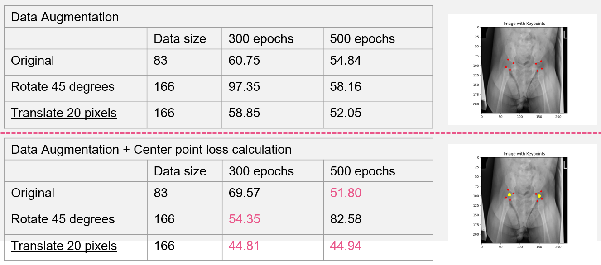
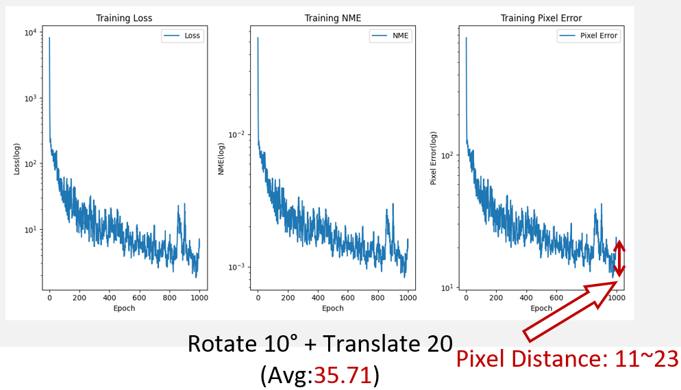

# Hip Joint Key Points Detection

## Introduction

在這個實驗中，我們將透過不同的模型與方法來進行髖關節關鍵點的偵測，並且比較不同方法的效果。

In this lab, we will use different models and methods to detect the key points of the hip joint and compare the effects of different methods.


## Dataset

實驗使用的資料集為髖關節的X光片，共有83張圖片，每張圖片包含了髖關節的關鍵點。

The dataset used in the experiment is the X-ray images of the hip joint, which have 83 pictures, and each picture contains the key points of the hip joint.


- 原始資料放置於 `xray_IHDI` 資料夾中
- 分割後的資料放置於 `data` 資料夾中

- The original data is placed in the `xray_IHDI` folder
- The segmented data is placed in the `data` folder

可以使用以下指令進行資料的分割，可自行修改其中的程式碼，以調整分割比例、分割資料夾等參數：

You can use the following command to split the data, and you can modify the code to adjust the parameters such as the split ratio and the split folder:

```bash
python3 split.py
```

## Hyperparameters

- Image size: 224x224
- Batch size: 32
- Epochs: 1000, 500, 300
- Optimizer: Adam
- Loss function: Mean Squared Error

## Methods

### Data Augmentation 

| type | image |
| - | - |
| original |  |
| rotate 10 |  |
| rotate 45 |  |
| translate x20 y20 |  |

### Center point loss calculation

加入虛構的中心點，計算中心點與預測點中心的距離，並將此距離加入 Loss function 中。

Add a fictitious center point, calculate the distance between the center point and the predicted point center, and add this distance to the Loss function.



## Usage

### Training

You can configure the script through command-line arguments. Here are some examples:

```bash
python3 train.py --data_dir data --model_name efficientnet --epochs 1000 --learning_rate 0.01 --batch_size 32
```

```bash
usage: train.py [-h] --data_dir DATA_DIR --model_name MODEL_NAME [--epochs EPOCHS] [--learning_rate LEARNING_RATE]
                [--batch_size BATCH_SIZE]

optional arguments:
  -h, --help            show this help message and exit
  --data_dir DATA_DIR   Path to the dataset directory
  --model_name MODEL_NAME
                        Model name: 'efficientnet', 'resnet', or 'vgg'
  --epochs EPOCHS       Number of training epochs
  --learning_rate LEARNING_RATE
                        Learning rate
  --batch_size BATCH_SIZE
                        Number of samples per batch
```

<hr>

- 訓練結果將會儲存在 `logs` 資料夾中：
  - [model-name]\_training_plot\_[epochs]\_[learning_rate]\_[batch_size].png: 放置訓練過程中的 Loss 、 NME 與 pixel 距離的圖表
  - [model-name]\_training_log\_[epochs]\_[learning_rate]\_[batch_size].txt: 放置訓練過程中的 Loss 、 NME 與 pixel 距離的數值

- The results will be saved in the `logs` folder:
    - [model-name]\_training_plot\_[epochs]\_[learning_rate]\_[batch_size].png: contains the chart of Loss, NME, and pixel distance during training
    - [model-name]\_training_log\_[epochs]\_[learning_rate]\_[batch_size].txt: contains the values of Loss, NME, and pixel distance during training


此圖表為 EfficientNet 在 1000 epochs 時的訓練過程，包含了 **Loss 、 NME 與 pixel 距離**，並對該圖進行**對數轉換**。

This chart is the training process of EfficientNet at 1000 epochs, including **Loss, NME, and pixel distance**, and the chart is **logarithmically transformed**.

<hr>

- 訓練後的模型將會儲存在 `models` 資料夾中。
    - [model-name]\_keypoint\_[epochs]\_[learning_rate]\_[batch_size].pth: 放置訓練後的模型

- The trained models will be saved in the `models` folder.
    - [model-name]\_keypoint\_[epochs]\_[learning_rate]\_[batch_size].pth: contains the trained model

### Prediction and Evaluation

You can configure the script through command-line arguments. Here are some examples:

```bash
python3 predict.py --model_name "efficientnet" --model_path "models/efficientnet_keypoint_1000_0.01_32.pth" --data "data/test" --output_dir "results" 
```
```bash
usage: predict.py [-h] --model_name MODEL_NAME --model_path MODEL_PATH --data DATA [--output_dir OUTPUT_DIR]

optional arguments:
  -h, --help            show this help message and exit
  --model_name MODEL_NAME
                        Model name: 'efficientnet', 'resnet', or 'vgg'
  --model_path MODEL_PATH
                        path to the trained model
  --data DATA           data directory
  --output_dir OUTPUT_DIR
                        output directory for predictions
```


此圖為 EfficientNet 在 1000 epochs 時的預測結果，使用了測試資料集，包含了 **預測圖片** 與 **平均 pixel 距離**。

This image is the prediction result of EfficientNet at 1000 epochs, using the test dataset, including **predicted images** and **average pixel distance**.

## Results

- 使用 EfficientNet 在 300 與 500 epochs 時的訓練結果：

使用資料增強與中心點損失計算的方法，可以提升模型的效果。
Using data augmentation and center point loss calculation methods can improve the model's performance.

- 使用 EfficientNet 在 1000 epochs 時，使用 Rotate 10° + Translate 20 加強後的訓練結果：
    
    
使用 Rotate 10° + Translate 20 的資料增強方法，得到最佳的效果。
The best result is obtained using the Rotate 10° + Translate 20 data augmentation method.