# 基於深度學習的髖關節關鍵點偵測系統

<div align="center">
  <div>
    <a href="https://github.com/tana0101/Hip-Joint-Keypoint-Detection/README_zh_TW.md">🇹🇼繁體中文</a> |
    <a href="https://github.com/tana0101/Hip-Joint-Keypoint-Detection/README.md">🌏English</a> |
    <a href="https://deepwiki.com/tana0101/Hip-Joint-Keypoint-Detection">📚DeepWiki</a> |
    <a href="https://github.com/tana0101/Hip-Joint-Keypoint-Detection/issues">❓issues</a> |
    <a href="">📝Paper(尚未發表)</a>
  </div>
<br>
  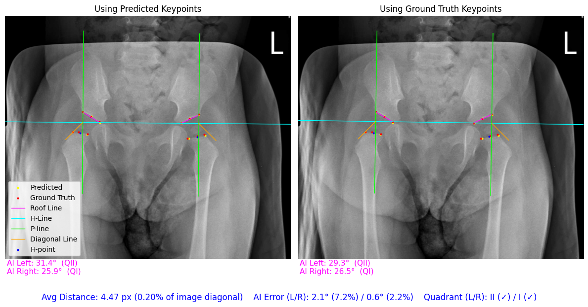
<br>

</div>

本專案提出一套**基於深度學習的髖關節關鍵點偵測系統**，目的在協助醫療專業人員進行**小兒髖關節發育不良（Developmental Dysplasia of the Hip, DDH）**之早期診斷與治療規劃，降低人為判讀誤差，並提升臨床量測的一致性與效率。

## Introduction

小兒髖關節發育不良（DDH）是一種常見但容易被忽略的骨骼發育疾病，若未能及早診斷與介入，可能對孩童未來的行走能力與骨骼發育造成長期影響。

在臨床實務上，DDH 的診斷高度仰賴醫師對 X 光影像的人工判讀與量測，過程具有一定的主觀性，且在不同醫師或不同時間點之間，容易產生量測差異。

近年來，深度學習在醫學影像分析領域展現出卓越的表現，特別適合應用於關鍵點偵測、角度量測與疾病分級等任務。本專案即利用深度學習模型，自動偵測髖關節關鍵點，進一步輔助臨床進行 DDH 相關指標的計算與分類。

## Key Features

- **髖關節關鍵點偵測**：自動預測髖關節關鍵點座標。
- **臨床指標量測**：支援 Acetabular Index (AI) Angle 計算與 IHDI 分類。
- **多模型架構支援**：可彈性選擇不同 Backbone（如 ConvNeXt、HRNet、EfficientNet 等）。
- **多種 Head 設計**：支援 Direct Regression 與 SimCC 系列等不同關鍵點預測策略。
- **模組化設計**：方便進行模型替換、實驗比較與擴充研究。

## Dataset

- 資料存放於 `dataset/` 目錄中。
- 標註程式位於 `Keypoint-Annotation-Tool/` 目錄中。
🚧 **資料集下載與整理流程將於後續補充** 🚧

### xray_IHDI（主要實驗資料集）
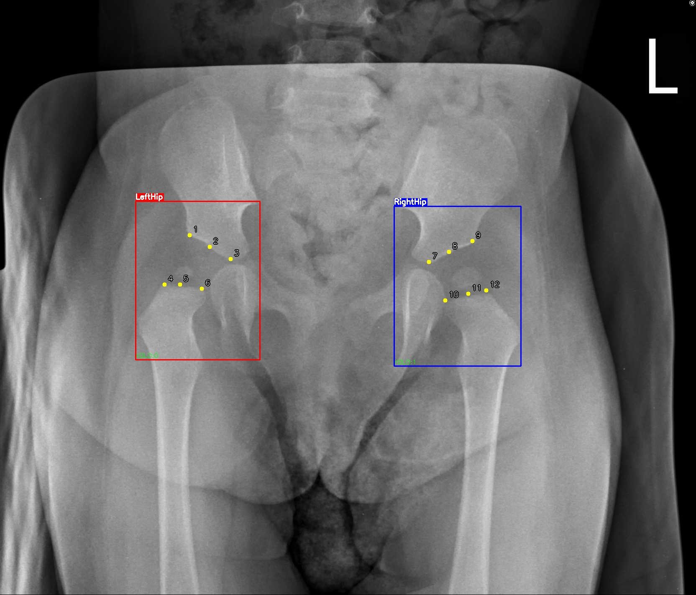

本研究採用回溯性資料，收集來自成大醫院於 2015 年 1 月 1 日至 2025 年 1 月 19 日期間，接受髖部超音波檢查之 4 歲以下嬰幼兒之 X 光影像資料。共納入 622 份 X 光影像，影像內容涵蓋髖關節發育正常與發育不良之個案。每張影像均經臨床專業醫師手動標註十二個關鍵點，作為後續模型訓練之標籤。

- 每張圖片對應一個標註 `.csv` 檔案，內容類似：
```
"(x1,y1)","(x2,y2)",...,"(x12,y12)"
```

- 資料來源：成大醫院
- 資料量：557 張髖關節 X 光影像（已排除異常值）
- 標註內容：
  - 12 個髖關節關鍵點
  - LeftHip / RightHip 物件標籤
- 備註：基於醫療資料保護與隱私規範，**無法公開釋出**


### MTDDH（公開資料集）
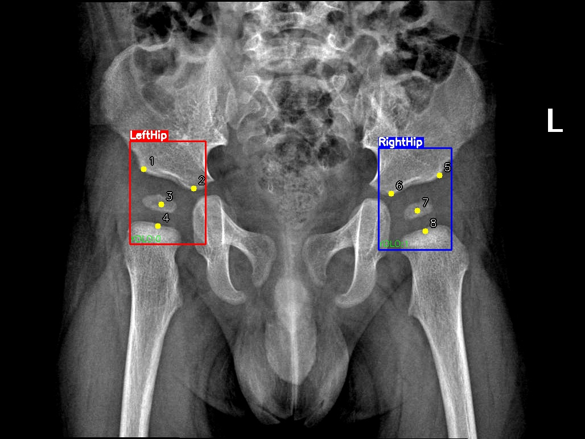

- 資料來源：[open-hip-dysplasia](https://github.com/radoss-org/open-hip-dysplasia.git)
- 資料量：1751 張髖關節 X 光影像（已排除異常值）
- 標註內容：
  - 8 個髖關節關鍵點
  - LeftHip / RightHip 物件標籤

### 資料統計分佈

**Acetabular Index (AI) 分佈**
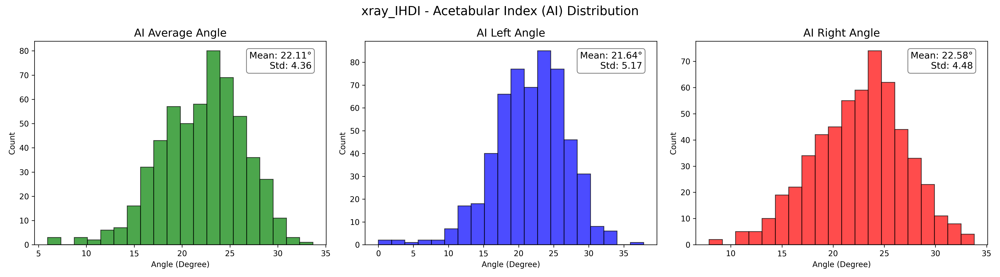
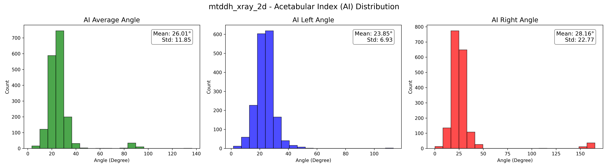

**IHDI 分類分佈**
<div style="display: flex; justify-content: space-between; gap: 10px;">
  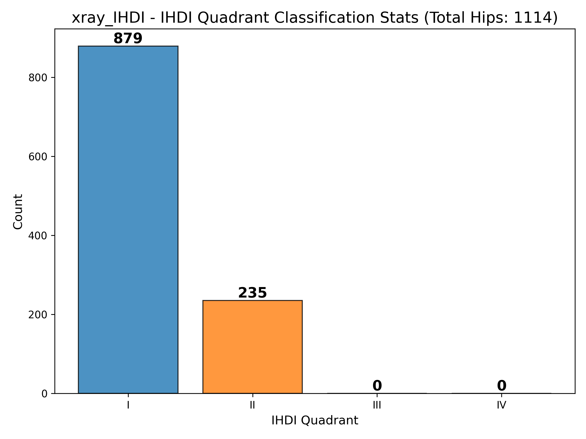
  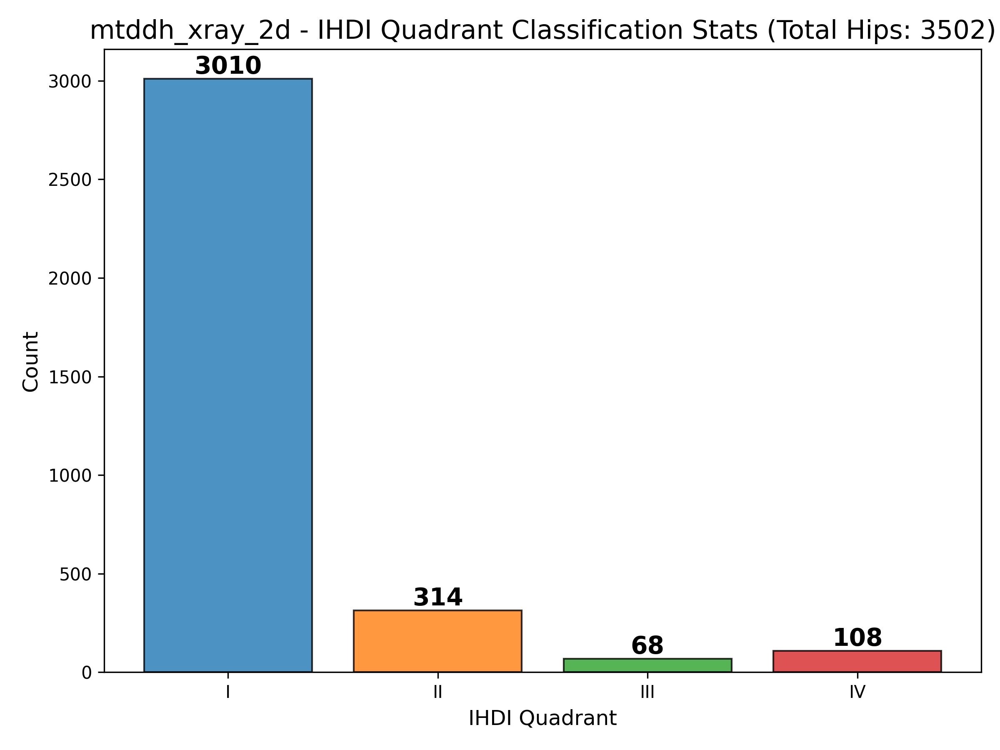
</div>

## Methodology

本專案採用兩階段方法進行髖關節關鍵點偵測：
1. **物件偵測階段**：使用 YOLO 模型
2. **關鍵點偵測階段**：使用多種 Backbone 與 Head 架構的深度學習模型

### Head Architecture

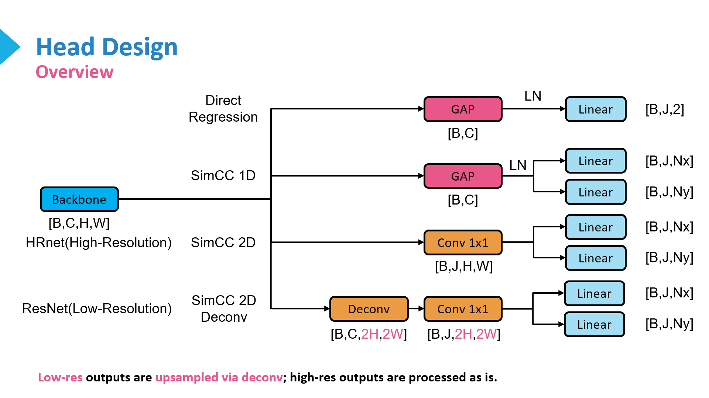

本專案支援多種關鍵點 Head 設計，以因應不同模型特性與實驗需求：

- **SimCC 2D / SimCC 2D Deconv**  
  屬於官方 SimCC 系列方法，將關鍵點座標回歸問題轉換為兩個一維分類問題，分別預測 x 軸與 y 軸的離散位置機率分佈，並透過 soft-argmax 計算最終座標。

- **SimCC 1D（自訂變體）**  
  為本研究自行設計的 SimCC 變體，透過 Global Average Pooling 將特徵圖壓縮為一維向量，並使用全連接層預測 x 與 y 軸的位置機率分佈，以降低模型複雜度。

- **Direct Regression**  
  傳統關鍵點回歸方法，直接以全連接層輸出關鍵點的 x、y 座標。

### Backbone Architecture

目前支援的 Backbone 架構如下：

- ConvNeXtV1  
  - `ConvNeXtSmallCustom`
- ConvNeXtV1 + Feature Pyramid Network（多尺度特徵）  
  - `ConvNeXtSmallMS`
- HRNet  
  - `HRNetW32Custom`
  - `HRNetW48Custom`

其中 `Custom` 結尾代表本專案基於官方實作進行修改與優化，以更符合髖關節關鍵點偵測任務的需求。

🚧 **其他 Backbone（如 EfficientNet、InceptionNeXt 等）目前仍在開發與測試中，以確保可與不同 Head 架構相容** 🚧

### Other Techniques

- **Data Augmentation**
  - Random Rotation
  - Random Translation
- **Loss Functions**
  - Direct Regression：所有點與中心點的 MSE Loss
    \[
    L_{MSE} = \frac{1}{N} \sum_{i=1}^{N} \left( (x_i - \hat{x}_i)^2 + (y_i - \hat{y}_i)^2 \right)
    \]
  - SimCC 系列：KL Divergence Loss
    \[
    L_{KL} = \frac{1}{N} \sum_{i=1}^{N} \left( D_{KL}(P_{x_i} || \hat{P}_{x_i}) + D_{KL}(P_{y_i} || \hat{P}_{y_i}) \right)
    \]
- **Optimizers**
  - AdamW
- **Learning Rate Schedulers**
  - Cosine Annealing
  - Warmup

## Installation

按照以下方式安裝所需的 Python 環境與套件，或是直接執行再補上缺少的套件。

### 使用 Conda 創建虛擬環境

1. 複製專案：
```
   git clone https://github.com/tana0101/Hip-Joint-Keypoint-Detection.git
   cd Hip-Joint-Keypoint-Detection
```
2. 創建並啟動 Conda 虛擬環境：
```
   conda create -n hip_joint_detection python=3.10
   conda activate hip_joint_detection
```
3. 安裝所需套件：
```
   pip install -r requirements.txt
```

### 使用一般 Python 環境

1. 複製專案：
```
   git clone https://github.com/tana0101/Hip-Joint-Keypoint-Detection.git
   cd Hip-Joint-Keypoint-Detection
```
2. 安裝所需套件：
```
   pip install -r requirements.txt
```

## Usage-Onefold Training & Evaluation

### Split Dataset

使用方式：
```
usage: split.py [-h] --dataset DATASET [--out OUT] [--train TRAIN] [--val VAL]
                [--test TEST] [--seed SEED]

Split dataset into train/val/test with multiple modalities and emit
Ultralytics data.yaml

options:
  -h, --help         show this help message and exit
  --dataset DATASET  Root directory of the dataset, e.g., dataset/xray_IHDI_5
  --out OUT          Output root directory (default: data)
  --train TRAIN      Train split ratio (default: 0.8)
  --val VAL          Validation split ratio (default: 0.1)
  --test TEST        Test split ratio (default: 0.1)
  --seed SEED        Random seed (default: 42)
```

範例執行：
```
python split.py --dataset dataset/xray_IHDI_6 --out data --train 0.8 --val 0.1 --test 0.1 --seed 42
```

將會分割出 `data/train`、`data/val`、`data/test` 三個子目錄，並產生物件偵測用的 `data/data.yaml` 檔案供後續訓練使用。

### Training

由於本專案採用兩階段，先使用 YOLO 偵測並裁切出髖關節區域，再進行單邊關鍵點偵測模型的訓練。

#### Step 1: Train YOLO Detector

使用方式：
```
python train_yolo.py \
  --model yolo12s.pt \
  --data data/data.yaml \
  --epochs 300 --imgsz 640 --batch 8 --device 0 \
  --project runs/train --name yolo12s --pretrained --seed 42 \
  --fliplr 0.0 --flipud 0.0 --degrees 5.0 \
  --shear 0.0 --perspective 0.0 --mosaic 0.0 --mixup 0.0
```

#### Step 2: Train Keypoint Detector

使用方式：
```
usage: train_hip_crop_keypoints.py [-h] --data_dir DATA_DIR --model_name
                                   MODEL_NAME [--epochs EPOCHS]
                                   [--input_size INPUT_SIZE]
                                   [--learning_rate LEARNING_RATE]
                                   [--batch_size BATCH_SIZE]
                                   [--side {left,right}] [--mirror]
                                   [--head_type {direct_regression,simcc_1d,simcc_2d,simcc_2d_deconv}]
                                   [--split_ratio SPLIT_RATIO] [--sigma SIGMA]

options:
  -h, --help            show this help message and exit
  --data_dir DATA_DIR   Path to the dataset directory
  --model_name MODEL_NAME
                        Model name: 'efficientnet', 'resnet', or 'vgg'
  --epochs EPOCHS       Number of training epochs
  --input_size INPUT_SIZE
                        Input image size for the model
  --learning_rate LEARNING_RATE
                        Learning rate
  --batch_size BATCH_SIZE
                        Number of samples per batch
  --side {left,right}   Side to train on: 'left' or 'right'
  --mirror              Whether to include mirrored data from the opposite
                        side
  --head_type {direct_regression,simcc_1d,simcc_2d,simcc_2d_deconv}
                        Type of model head to use
  --split_ratio SPLIT_RATIO
                        SimCC split ratio for label encoding
  --sigma SIGMA         Sigma for SimCC label encoding
```

範例執行：
```
python3 train_hip_crop_keypoints.py --data_dir data --model_name convnext_small_custom --input_size 224 --epochs 200 --learning_rate 0.0001 --batch_size 32 --side left --mirror --head_type simcc_2d --split_ratio 3.0 --sigma 7.0
```

訓練結果：
- 最佳模型會存為：
```
weights/{model_name}_{head_type}_{split_ratio}_{sigma}_{side}_{mirror}_{input_size}_{epochs}_{learning_rate}_{batch_size}_best.pth
```
範例：convnext_small_custom_simcc_2d_sr3.0_sigma7.0_cropleft_mirror_224_200_0.0001_32_best.pth 
- 訓練過程圖表會存為：
```
logs/{model_name}_{head_type}_{split_ratio}_{sigma}_{side}_{mirror}_{input_size}_{epochs}_{learning_rate}_{batch_size}_training_plot.png
```
範例：convnext_small_custom_simcc_2d_sr3.0_sigma7.0_cropleft_mirror_224_200_0.0001_32_training_plot.png
- 訓練日誌會存為：
```
logs/{model_name}_{head_type}_{split_ratio}_{sigma}_{side}_{mirror}_{input_size}_{epochs}_{learning_rate}_{batch_size}_training_log.txt
```
範例：convnext_small_custom_simcc_2d_sr3.0_sigma7.0_cropleft_mirror_224_200_0.0001_32_training_log.txt

### Evaluation

使用方式：
```
usage: predict_hip_crop_keypoints.py [-h] --model_name MODEL_NAME
                                     [--kp_left_path KP_LEFT_PATH]
                                     [--kp_right_path KP_RIGHT_PATH]
                                     --yolo_weights YOLO_WEIGHTS --data DATA
                                     [--output_dir OUTPUT_DIR]
                                     [--fold_index FOLD_INDEX]

options:
  -h, --help            show this help message and exit
  --model_name MODEL_NAME
                        efficientnet | resnet | vgg
  --kp_left_path KP_LEFT_PATH
                        left-side KP model (.pth)
  --kp_right_path KP_RIGHT_PATH
                        right-side KP model (.pth)
  --yolo_weights YOLO_WEIGHTS
                        YOLO weights (e.g., best.pt)
  --data DATA           data directory
  --output_dir OUTPUT_DIR
                        output directory
  --fold_index FOLD_INDEX
                        fold index for k-fold cross-validation (optional)
```
範例執行：
```
python3 predict_hip_crop_keypoints.py --model_name convnext_small_custom --kp_left_path weights/convnext_small_custom_simcc_2d_sr3.0_sigma7.0_cropleft_mirror_224_200_0.0001_32_best.pth --yolo_weights models/yolo12s.pt --data "data/test" --output_dir "results"
```

統計結果會存於 `{output_dir}` 目錄中。
注意：請確保物件偵測權重（yolo_weights）與關鍵點權重（kp_path）皆已訓練完成並存在對應路徑。

## Usage-K-Fold Cross Validation

### Split Dataset

使用方式：
```
usage: kfold_split.py [-h] --src SRC --dst DST [--k K] [--seed SEED]
                      [--overwrite]

K-fold split for object detection and keypoint datasets

options:
  -h, --help   show this help message and exit
  --src SRC    Source directory containing images/, annotations/, detections/, yolo_labels/
  --dst DST    Destination directory where fold1..foldK and data_fold{i}.yaml will be created
  --k K        Number of folds
  --seed SEED  Random seed for shuffling
  --overwrite  If the destination directory exists, delete it before creating new folds
```
範例執行：
```
python kfold_split.py \
  --src dataset/xray_IHDI_6 \
  --dst data \
  --k 5 \
  --seed 42 \
  --overwrite
```

### Training

#### Step 1: Train YOLO Detector

使用方式：
```
python kfold_train_yolo.py \
  --model yolo12s.pt \
  --data_tpl data/data_fold{fold}.yaml \
  --k 5 \
  --epochs 300 --imgsz 640 --batch 8 --device 0 \
  --project runs/train --name yolo12s_kfold --pretrained --seed 42 \
  --fliplr 0.0 --flipud 0.0 --degrees 5.0 \
  --shear 0.0 --perspective 0.0 --mosaic 0.0 --mixup 0.0
```

#### Step 2: Train Keypoint Detector

使用方式：
```
usage: kfold_train_hip_crop_keypoints.py [-h] --data_root DATA_ROOT [--k K]
                                         [--mode {outer_inner,val_as_test}]
                                         [--inner_val_ratio INNER_VAL_RATIO]
                                         [--inner_seed INNER_SEED] [--copy]
                                         --model_name MODEL_NAME
                                         [--epochs EPOCHS]
                                         [--input_size INPUT_SIZE]
                                         [--learning_rate LEARNING_RATE]
                                         [--batch_size BATCH_SIZE]
                                         [--side {left,right}] [--mirror]
                                         [--head_type {direct_regression,simcc_1d,simcc_2d,simcc_2d_deconv}]
                                         [--split_ratio SPLIT_RATIO]
                                         [--sigma SIGMA]

K-fold training for hip crop keypoints.

options:
  -h, --help            show this help message and exit
  --data_root DATA_ROOT
                        包含 fold1..foldK 的資料夾，例如 data 或
                        dataset/xray_IHDI_5_kfold
  --k K                 fold 數量
  --mode {outer_inner,val_as_test}
                        outer_inner = Outer K-fold + Inner split; val_as_test
                        = 單層 K-fold，val 同時也是之後的 test fold
  --inner_val_ratio INNER_VAL_RATIO
                        在 outer_inner 模式下，Train pool 裡用多少比例做 inner validation
  --inner_seed INNER_SEED
                        在 outer_inner 模式下，inner split 的亂數種子
  --copy                預設用 symlink 建 tmp/train,val；加這個就改成實際複製檔案（較耗空間）
  --model_name MODEL_NAME
                        Model name: 'efficientnet', 'resnet', 'vgg',
                        'convnext' 等
  --epochs EPOCHS
  --input_size INPUT_SIZE
  --learning_rate LEARNING_RATE
  --batch_size BATCH_SIZE
  --side {left,right}
  --mirror
  --head_type {direct_regression,simcc_1d,simcc_2d,simcc_2d_deconv}
  --split_ratio SPLIT_RATIO
                        SimCC 的 sr 參數，用在 head_type 為 simcc* 時
  --sigma SIGMA         SimCC label encoding 的 sigma
```
範例執行：
```
python kfold_train_hip_crop_keypoints.py \
  --data_root data \
  --k 5 \
  --mode outer_inner \
  --inner_val_ratio 0.1 \
  --inner_seed 42 \
  --model_name convnext_small_custom \
  --input_size 224 \
  --epochs 200 \
  --learning_rate 0.0001 \
  --batch_size 16 \
  --side left \
  --mirror \
  --head_type simcc_2d \
  --split_ratio 3.0 \
  --sigma 7.0
```

訓練結果會存於 `weights/` 目錄中，檔名格式如下：
```
{model_name}_{head_type}_sr{split_ratio}_sigma{sigma}_crop{side}_{mirror}_{input_size}_{epochs}_{learning_rate}_{batch_size}_fold{fold}_best.pth
```

注意：請確保 data_root 目錄中已包含 k-fold 分割後的資料夾（fold1..foldK）與對應的 data_fold{i}.yaml 檔案。

### Evaluation

使用方式：
```
usage: kfold_predict_hip_crop_keypoints.py [-h] --model_name MODEL_NAME
                                           [--kp_left_tpl KP_LEFT_TPL]
                                           [--kp_right_tpl KP_RIGHT_TPL]
                                           --yolo_weights YOLO_WEIGHTS
                                           --data_root DATA_ROOT [--k K]
                                           [--output_root OUTPUT_ROOT]

K-fold test for hip crop keypoints.

options:
  -h, --help            show this help message and exit
  --model_name MODEL_NAME
                        efficientnet | resnet | vgg | convnext ...
  --kp_left_tpl KP_LEFT_TPL
                        左側 KP model 路徑模板，例如:
                        'weights/convnext_left_fold{fold}_best.pth'，會用
                        .format(fold=i) 產生每個 fold 的路徑。
  --kp_right_tpl KP_RIGHT_TPL
                        右側 KP model 路徑模板，可留空。
  --yolo_weights YOLO_WEIGHTS
                        YOLO weights (e.g., weights/yolo12s_fold{fold}.pt)
  --data_root DATA_ROOT
                        包含 fold1, fold2, ... 的資料夾，例如 data 或
                        dataset/xray_IHDI_5_kfold
  --k K                 fold 數量
  --output_root OUTPUT_ROOT
                        每個 fold 的輸出根目錄（下層會自動建立 fold1, fold2, ...）
```
範例執行：
```
python kfold_predict_hip_crop_keypoints.py \
  --model_name convnext_small_custom \
  --kp_left_tpl "weights/convnext_small_custom_simcc_2d_sr3.0_sigma7.0_cropleft_mirror_224_200_0.0001_16_fold{fold}_best.pth" \
  --yolo_weights weights/yolo12s_fold{fold}.pt \
  --data_root data \
  --k 5 \
  --output_root results_kfold
```

統計結果會存於 `{output_root}/{name}/fold{i}` 目錄以及`{output_root}/{name}/summary` 資料夾中
注意：請確保物件偵測權重（yolo_weights）與關鍵點權重（kp_path）皆已訓練完成並存在對應路徑。

## Inference

🚧臨床使用的介面正在開發中🚧
位於 `Hip-Joint-Keypoint-Detection-Tool/` 目錄下的程式碼為單階段關鍵點偵測系統的初步介面，僅供參考。

## Results

不同head的實驗結果：
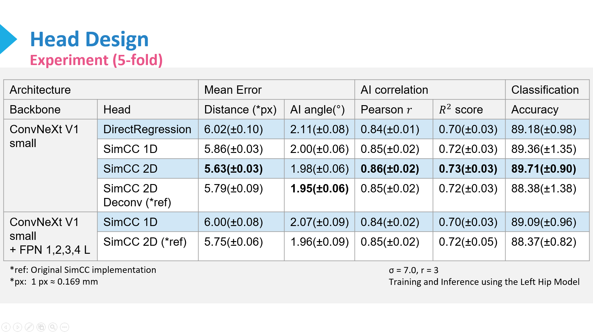

使用 ConvNeXtSmallCustom + SimCC 2D 的模型在 xray_IHDI 資料集上進行 5-fold 交叉驗證的結果如下：

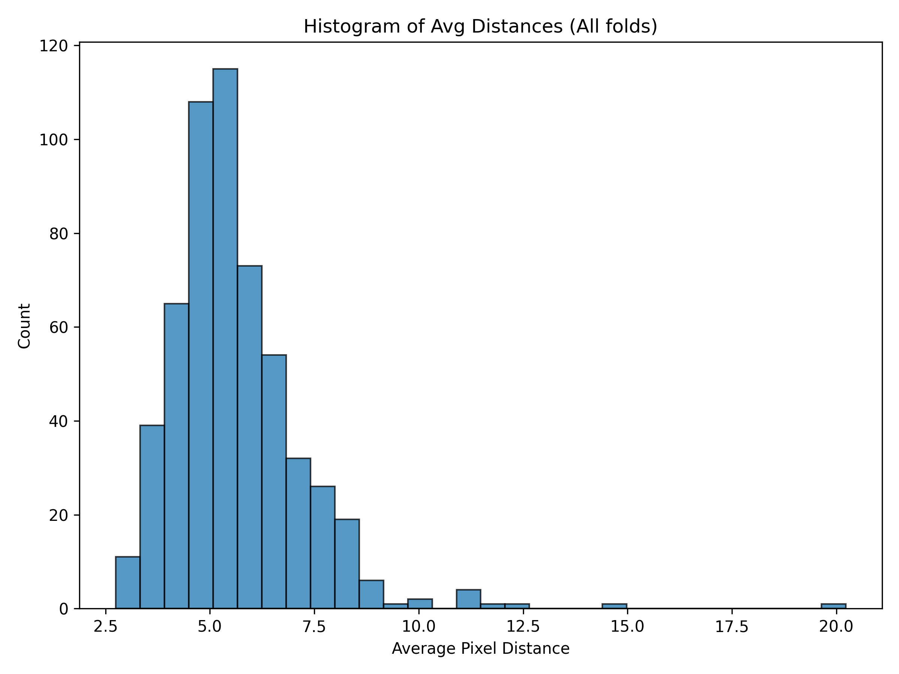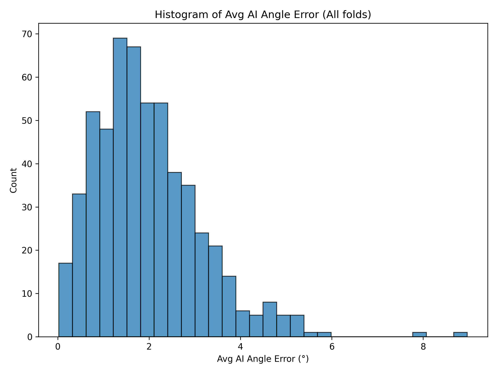
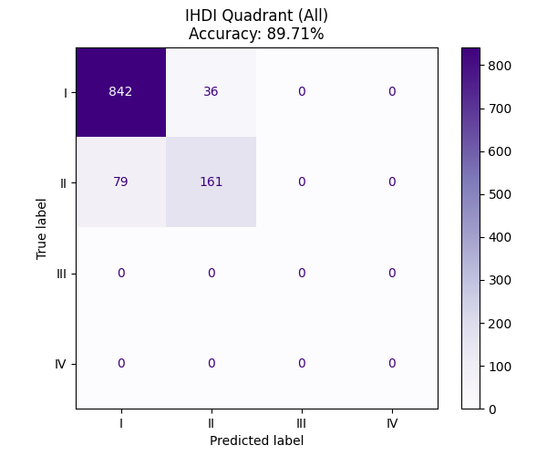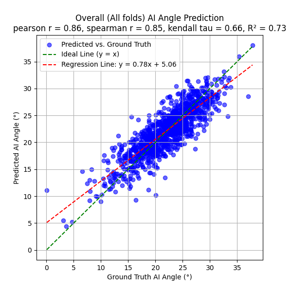

## References

- [SimCC](https://github.com/leeyegy/SimCC.git)
- [ConvNeXtV1](https://github.com/facebookresearch/ConvNeXt.git)
- [ConvNextV2](https://github.com/facebookresearch/ConvNeXt-V2.git)
- [EfficientNet](https://docs.pytorch.org/vision/main/models/efficientnet)
- [MambaVision](https://github.com/NVlabs/MambaVision.git)
- [InceptionNeXt](https://github.com/sail-sg/inceptionnext.git)
- [HRNet-Bottom-Up-Pose-Estimation](https://github.com/HRNet/HRNet-Bottom-Up-Pose-Estimation.git)
- [YOLO](https://docs.ultralytics.com/)

## Note

核心演算法與部分關鍵技術細節基於研究與合作考量，暫不公開。  
如對本專案有興趣，歡迎聯絡作者或是發送 Issue 進行討論。