# 🦴 Deep Learning-Based Keypoint Detection for Predicting Developmental Dysplasia of the Hip from Pediatric Hip Radiographs

<div align="center">
  <div>
    <a href="https://github.com/tana0101/Hip-Joint-Keypoint-Detection/blob/main/README_zh_TW.md">🇹🇼 Traditional Chinese</a> |
    <a href="https://github.com/tana0101/Hip-Joint-Keypoint-Detection/blob/main/README.md">🌏 English</a> |
    <a href="https://deepwiki.com/tana0101/Hip-Joint-Keypoint-Detection">📚 DeepWiki</a> |
    <a href="https://github.com/tana0101/Hip-Joint-Keypoint-Detection/issues">❓ Issues</a> |
    📝 Paper (restricted by confidentiality agreement)
  </div>

<br>

  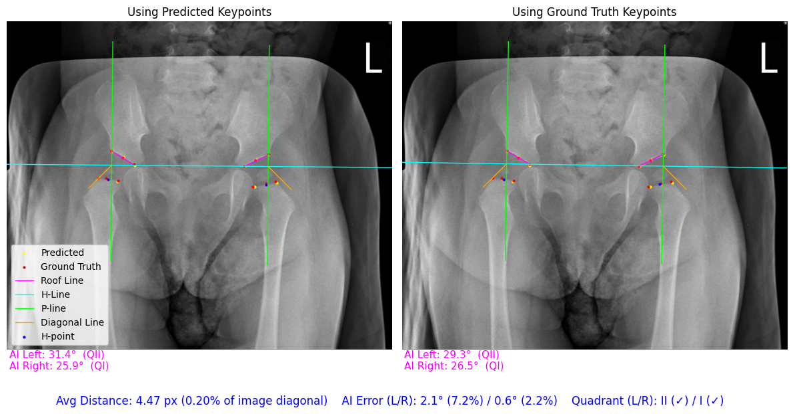

<br>

  <a href="https://app.codacy.com/gh/tana0101/Hip-Joint-Keypoint-Detection/dashboard?utm_source=gh&utm_medium=referral&utm_content=&utm_campaign=Badge_grade"></a>
  
  
  <a href="https://deepwiki.com/tana0101/Hip-Joint-Keypoint-Detection"></a>
  
  
</div>

## 📋 Overview

Developmental Dysplasia of the Hip (**DDH**) may lead to long-term impairment of a child's walking ability if it is not diagnosed early. In clinical practice, DDH assessment relies heavily on manual interpretation of X-ray images by physicians, which may result in subjective measurement variability.

This project proposes a **top-down, two-stage deep learning detection system** to assist with DDH measurement and classification:

1. **Automatic Detection and Localization**: YOLO is used to accurately localize the hip region of interest (ROI).
2. **Keypoint Prediction**: Anatomical keypoints are localized within each ROI, with either 12 or 8 hip keypoints annotated depending on the dataset.
3. **Clinical Measurement**: The system automatically calculates the **Acetabular Index (AI) angle** and outputs the **IHDI classification** result.

> **Research-only Notice**: This project is a prototype system developed for computer science research purposes. Its outputs must not be used directly as a basis for clinical diagnosis.

## ✨ Key Features

- 🧩 **Highly Modular Architecture (Modular Design)**  
  Object detection and keypoint prediction are decoupled, with a unified model interface designed to support rapid replacement of experimental configurations:
  - **Backbones**: Built-in support for ConvNeXt (V1/V2) and HRNet, with extensible interfaces for additional network architectures.
  - **Prediction Heads**: Supports the official SimCC implementation, modified SimCC variants, conventional Direct Regression, and Heatmap-based methods.

- ⚙️ **Microservice and Backend Integration (Backend-Ready)**  
  The core inference pipeline has been encapsulated as a backend Inference API and is currently being tested at National Cheng Kung University Hospital.

- 📊 **Comprehensive Evaluation Framework**  
  Includes complete K-Fold cross-validation and data visualization workflows, with automatic generation of confusion matrices and error-distribution plots.

## 💾 Dataset

- Datasets are stored under the `dataset/` directory.
- The annotation tool is located in `Keypoint-Annotation-Tool/`.

### 🏥 NCKUH_IHDI (National Cheng Kung University Hospital Dataset)

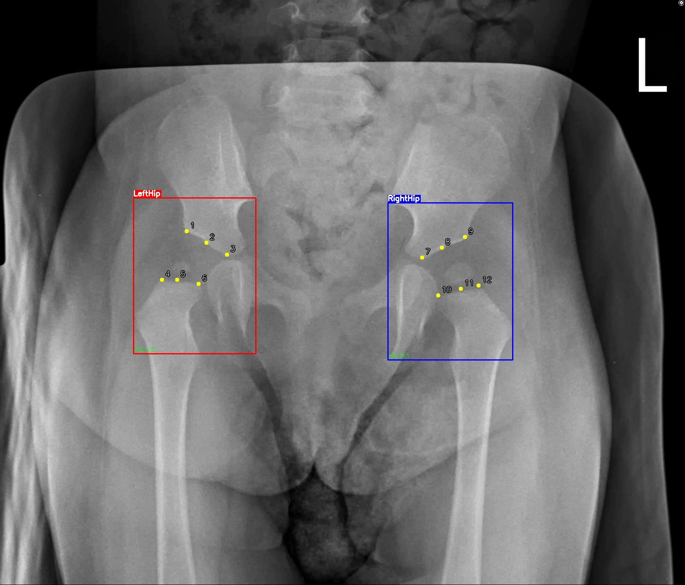

This study uses retrospectively collected hip X-ray images from National Cheng Kung University Hospital acquired between June 25, 2019 and January 7, 2025, with patient ages ranging from 1 to 59 months at the time of imaging. A total of 622 images were initially included, and 557 images remained after outlier exclusion. Each image was manually annotated by a clinical physician with **12 keypoints**, together with LeftHip / RightHip object labels for training the detection stage.

- Image annotation: each image corresponds to one `.csv` file in the following format:

```text
"(x1,y1)","(x2,y2)",...,"(x12,y12)"
```

- Note: Due to medical privacy and data protection requirements, this dataset cannot be publicly released.

<hr>

### 🌍 MTDDH (Public Dataset)

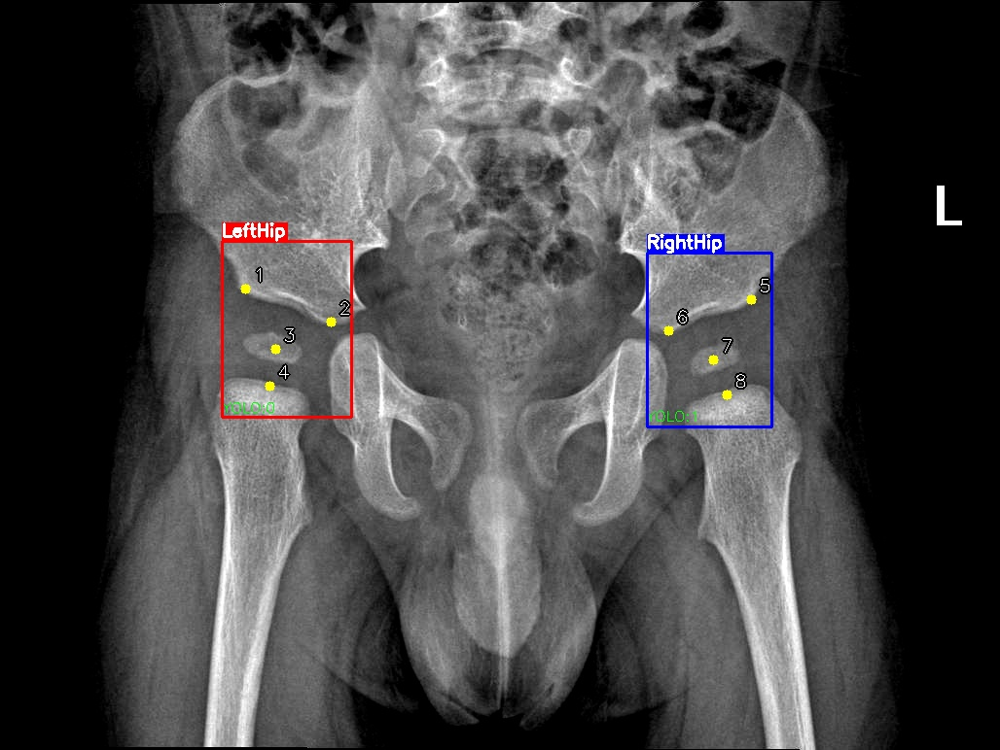

- Source: [open-hip-dysplasia](https://github.com/radoss-org/open-hip-dysplasia.git)
- Dataset size: 1,666 hip X-ray images after outlier exclusion
- Annotations:
  - **8 keypoints**
  - LeftHip / RightHip object labels

<hr>

### 📊 Dataset Statistics

**Acetabular Index (AI) Distribution**

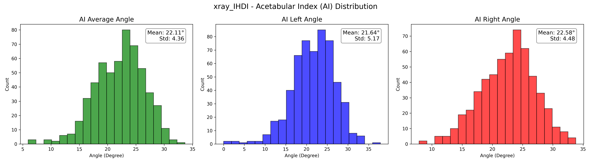

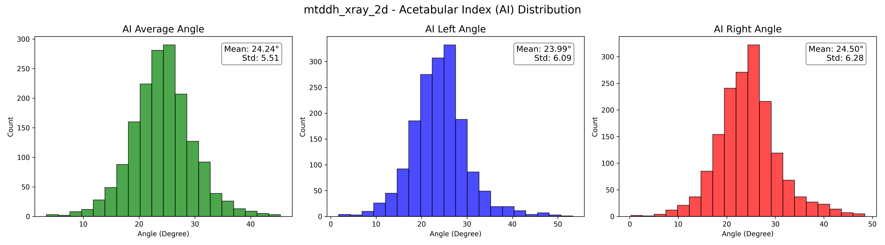

**IHDI Classification Distribution**

<div style="display: flex; justify-content: space-between; gap: 10px;">
  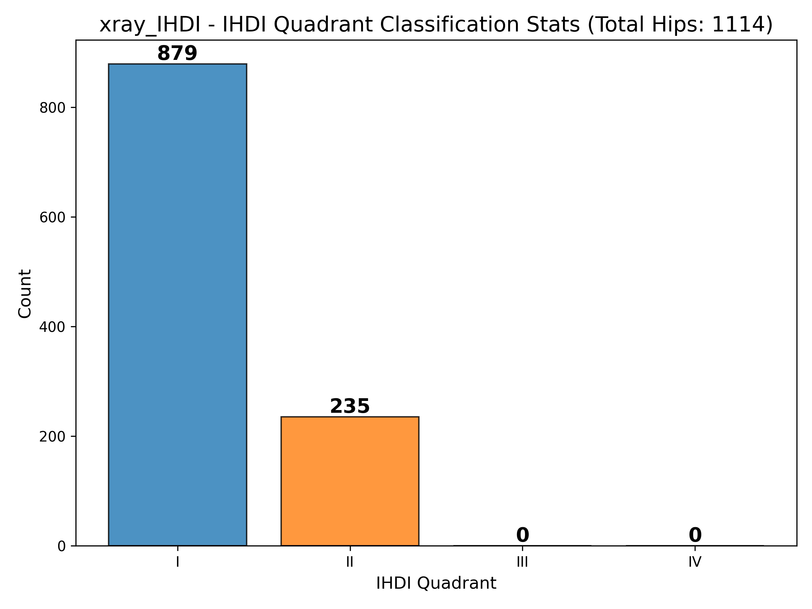
  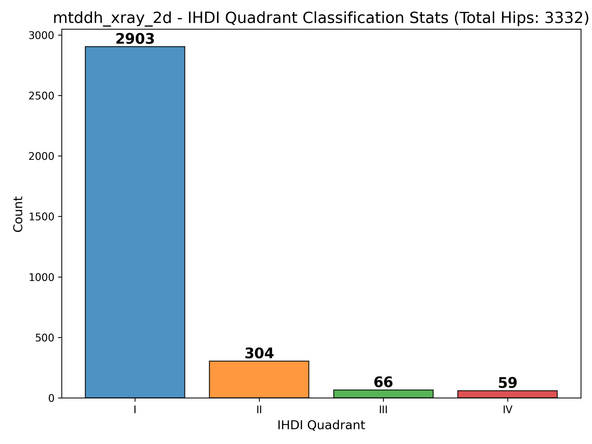
</div>

## 🏆 Model Performance & Results

The `ConvNeXtTinyMS` backbone with the `SimCC 2D` head was evaluated using 5-fold cross-validation on the public MTDDH dataset. The aggregated OOF (Out-of-Fold) results are shown below:

<p align="center">
  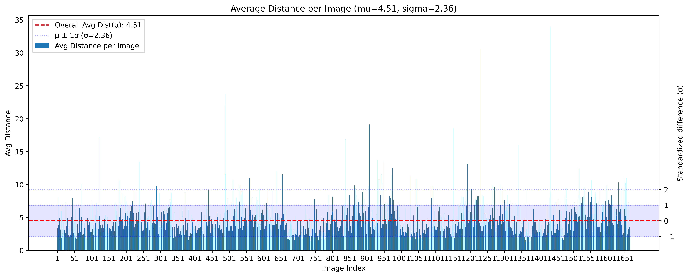
  <br>
  <b>(a) Keypoint Distance Error</b>
</p>

<p align="center">
  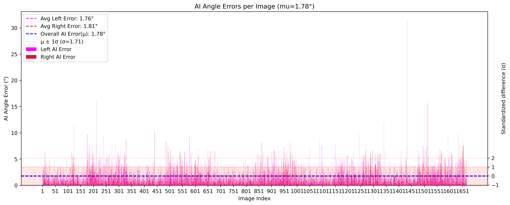
  <br>
  <b>(b) AI Angle Error</b>
</p>

<p align="center">
  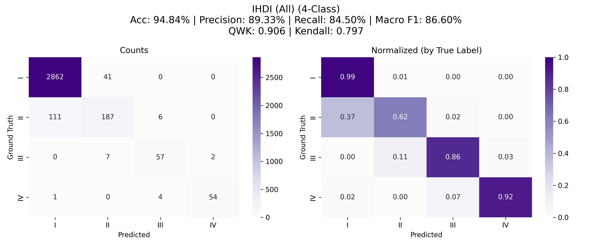
  <br>
  <b>(c) IHDI 4-Class Confusion Matrix</b>
</p>

<p align="center">
  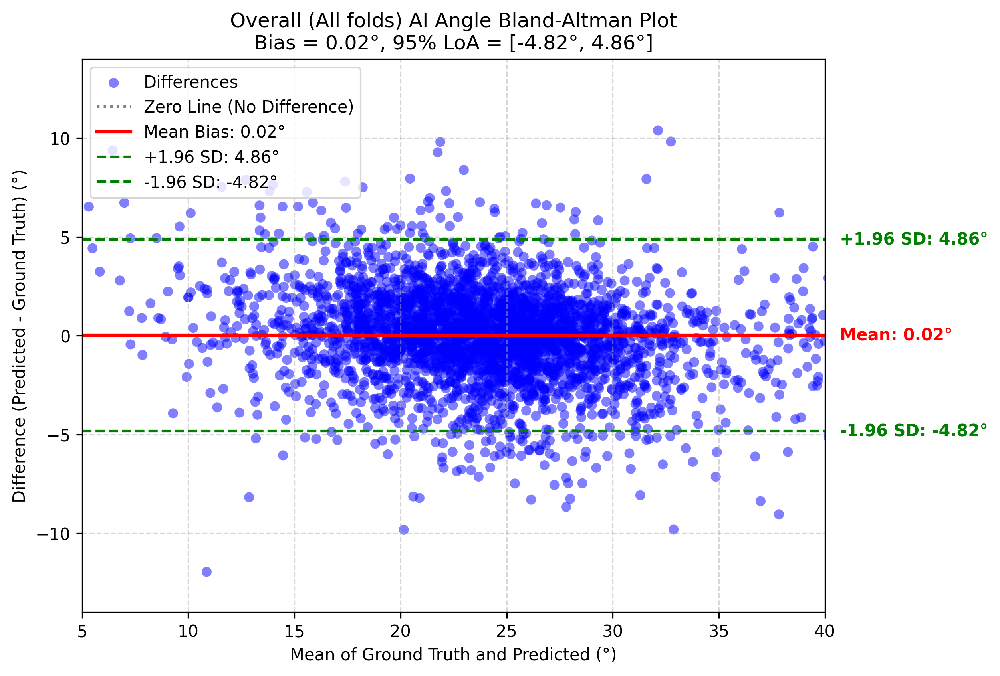
  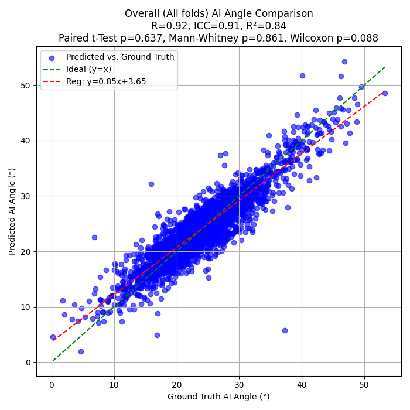
  <br>
  <b>(d) Bland-Altman & Scatter Plot of AI Angle</b>
</p>

## 🛠️ Methodology

This project adopts a **top-down two-stage keypoint detection pipeline**:

1. **🔍 Object Detection and Single-Side Cropping**: YOLO detects the LeftHip / RightHip regions and crops the corresponding ROIs to reduce background interference.
2. **🧠 Single-Side Keypoint Detection**: Keypoint detection is performed independently on each cropped hip ROI, supporting comparisons across multiple Backbone / Head configurations.

### Head Architecture

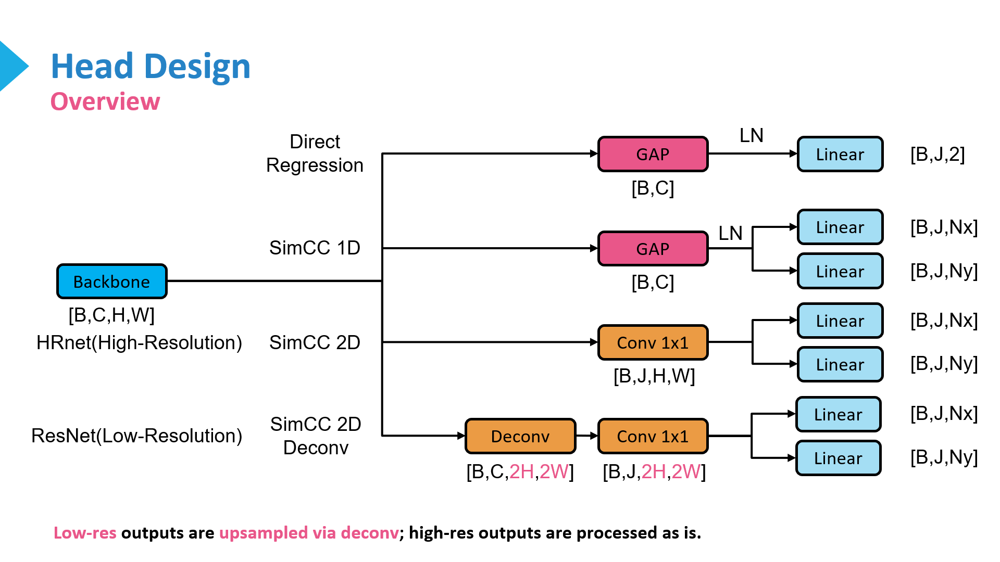

This project supports multiple keypoint head designs to accommodate different model characteristics and experimental requirements:

- **SimCC 2D / SimCC 2D Deconv**:  
  The official SimCC-based approaches convert coordinate regression into independent one-dimensional classification distributions along the x- and y-axes, with coordinates decoded using soft-argmax.

- **SimCC 1D (Custom Variant)**:  
  Global Average Pooling is used to compress the feature map, followed by fully connected layers that predict the x- and y-axis distributions with reduced computational complexity.

- **Direct Regression**:  
  Fully connected layers directly regress the `(x, y)` coordinates.

- **Heatmap**:  
  Follows the original HRNet implementation by producing two-dimensional heatmaps trained with MSE loss. During decoding, Argmax is used to identify the peak response, followed by a 0.25-pixel sub-pixel shift toward the second-highest response to compensate for quantization error.

> 💡 **For detailed implementations of the Head models and decoding logic, please refer to [`models/head.py`](models/head.py).**

### Backbone Architecture

The currently supported Backbone architectures are:

- ConvNeXtV1
  - `ConvNeXtTinyCustom`
- ConvNeXtV1 + Feature Pyramid Network (multi-scale features)
  - `ConvNeXtTinyMS` (`convnext_tiny_fpn1234concat`)
- HRNet
  - `HRNetW32Custom`
  - `HRNetW48Custom`

Models with the `Custom` suffix are modified and optimized based on the corresponding official implementations to better suit the hip keypoint detection task.

> 💡 **For all Backbone implementations, please refer to [`models/model.py`](models/model.py).**

🚧 **Other Backbones, such as EfficientNet and InceptionNeXt, are still under development and testing to ensure compatibility with different Head architectures.** 🚧

### Other Techniques

- **🔄 Data Augmentation**: Random Rotation / Random Translation
- **📉 Loss Functions**
  - **Direct Regression (MSE Loss)**
  - **Heatmap (MSE Loss)**
  - **SimCC Series (KL Divergence Loss)**
- **⚙️ Optimizers**: AdamW
- **📈 LR Schedulers**: Cosine Annealing + Warmup
- **Decoder**: Expectation, Heuristic

> 💡 **For detailed Decoder implementations, please refer to [`utils/simcc.py`](utils/simcc.py).**

## 📂 Project Structure

```text
Hip-Joint-Keypoint-Detection/
├── dataset/                          # 💾 Dataset directory
│   ├── xray_IHDI_2_clean/           # NCKUH dataset (Private)
│   └── mtddh_xray_2d/               # Public dataset
├── datasets/                         # Dataset loading and preprocessing modules
├── models/                           # 🧠 Model and Head definitions / implementations
├── src/                              # Core project resources and images
│   └── img/                          # Images used in README
├── utils/                            # 🛠️ Common utility functions
├── weights/                          # 📥 Trained model weights (.pth)
├── logs/                             # 📝 Training logs and loss curves
├── results/                          # 📊 Statistical and evaluation outputs
├── experiment/                       # Records of previous experiments
├── Keypoint-Annotation-Tool/         # 🖊️ Keypoint annotation tool
├── train_yolo.py                     # [Training] YOLO object detector
├── train_full_image_keypoints.py     # [Training] Bilateral full-image keypoint model
├── train_hip_crop_keypoints.py       # [Training] Single-side hip keypoint model
├── predict_full_image_keypoints.py   # [Inference] Full-image prediction and evaluation
├── predict_hip_crop_keypoints.py     # [Inference] Single-side prediction and evaluation
├── split.py                          # [Utility] Dataset split (Train/Val/Test)
├── split_from_json.py                # [Utility] Split dataset using the public split JSON
├── kfold_split.py                    # [Utility] K-Fold dataset splitting
├── kfold_train_yolo.py               # [K-Fold] YOLO cross-validation training
├── kfold_train_hip_crop_keypoints.py # [K-Fold] Keypoint cross-validation training
├── kfold_predict_hip_crop_keypoints.py # [K-Fold] Cross-validation evaluation
├── requirements.txt                  # 📦 Project dependencies
├── README.md                         # 🇬🇧 English documentation
└── README_zh_TW.md                   # 🇹🇼 Traditional Chinese documentation
```

## 🚀 Workflow Pipeline

The standard experimental and inference pipeline is as follows:

1. 📂 **Data Preparation**: Prepare the dataset first. For the public dataset, the `prepare_MTDDH_dataset` script can be used. Then run `split.py` or `kfold_split.py` to split the dataset.
2. 🔍 **Stage 1 (Detection)**: Run `train_yolo.py` or `kfold_train_yolo.py` to train the YOLO model for hip ROI detection and cropping, reducing background interference.
3. 🧠 **Stage 2 (Keypoint)**: Run `train_hip_crop_keypoints.py` or `kfold_train_hip_crop_keypoints.py` and specify the desired Backbone and Head to train the single-side keypoint model.
4. 📈 **Evaluation**: Run `predict_hip_crop_keypoints.py` or `kfold_predict_hip_crop_keypoints.py` to perform dataset inference and calculate AI angle errors and IHDI classification accuracy.

> 💡 **For detailed environment setup, the K-Fold cross-validation workflow, and complete command-line configurations, please refer to the [📖 Advanced Usage Guide](docs/USAGE_GUIDE.md).**

## 🔧 Analysis & Visualization Tools

In addition to the main training and evaluation pipeline, this project provides several utilities for dataset analysis and model result visualization:

- `visualize_single_simcc.py`  
  Visualizes keypoint predictions and SimCC probability distributions for a single image. This tool is useful for inspecting model predictions and analyzing abnormal or failure cases.  
  Results are saved to `simcc_vis_results/`.

- `analyze_hip_dataset.py`  
  Analyzes dataset statistics and distributions, including sample counts, AI, and IHDI distributions, and generates corresponding statistical plots.  
  The generated results can be found in the corresponding dataset directory under `dataset/`.

- `compare_dataset_annotations.py`  
  Compares keypoints, AI measurements, and related measurement differences between different annotation versions of the same dataset. This tool can be used to evaluate annotation consistency.  
  Results are saved to `annotation_comparison_results/`.

## ⚖️ License

This project is released under the **GNU Affero General Public License v3.0 (AGPL-3.0)**.

For details, please refer to the [LICENSE](LICENSE) file.

### Core Dependencies & Open-Source Acknowledgements

- **[Ultralytics YOLO](https://docs.ultralytics.com/)** (AGPL-3.0)
  - **Impact**: Because this project relies on YOLO for core training and inference functionality, the overall project follows the AGPL-3.0 requirements. If this project, or a modified version of it, is provided as a network service or publicly distributed, the corresponding source code must be made available.

- **[ConvNeXt V2](https://github.com/facebookresearch/ConvNeXt-V2)** (Meta Research)
  - **Code**: MIT License.
  - **Pretrained Weights**: **CC-BY-NC 4.0 (non-commercial use only)**.
  - **⚠️ Note**: If the official ConvNeXt V2 pretrained weights are used, the project is restricted to academic research or other non-commercial use under the applicable weight license.

- **[MambaVision](https://github.com/NVlabs/MambaVision)** (NVIDIA)
  - **License**: NVIDIA Source Code License-NC, which generally includes non-commercial-use restrictions. Please refer to the original repository for details.

- **[SimCC](https://github.com/leeyegy/SimCC)** (MIT)
- **[ConvNeXt V1](https://github.com/facebookresearch/ConvNeXt)** (MIT)
- **[EfficientNet](https://docs.pytorch.org/vision/main/models/efficientnet.html)** (BSD-3-Clause via TorchVision)
- **[InceptionNeXt](https://github.com/sail-sg/inceptionnext)** (Apache-2.0)
- **[HRNet (Bottom-Up)](https://github.com/HRNet/HRNet-Bottom-Up-Pose-Estimation)** (MIT)

We sincerely thank the authors and contributors of open-source projects such as SimCC and HRNet for their contributions to the deep learning community. For academic discussion or backend integration collaboration, please feel free to contact us through GitHub Issues.
