# 🦴基於深度學習的髖關節關鍵點偵測系統

<div align="center">
  <div>
    <a href="https://github.com/tana0101/Hip-Joint-Keypoint-Detection/blob/main/README_zh_TW.md">🇹🇼繁體中文</a> |
    <a href="https://github.com/tana0101/Hip-Joint-Keypoint-Detection/blob/main/README.md">🌏English</a> |
    <a href="https://deepwiki.com/tana0101/Hip-Joint-Keypoint-Detection">📚DeepWiki</a> |
    <a href="https://github.com/tana0101/Hip-Joint-Keypoint-Detection/issues">❓issues</a><!-- |
    📝Paper(尚未發表)-->
  </div>
<br>
  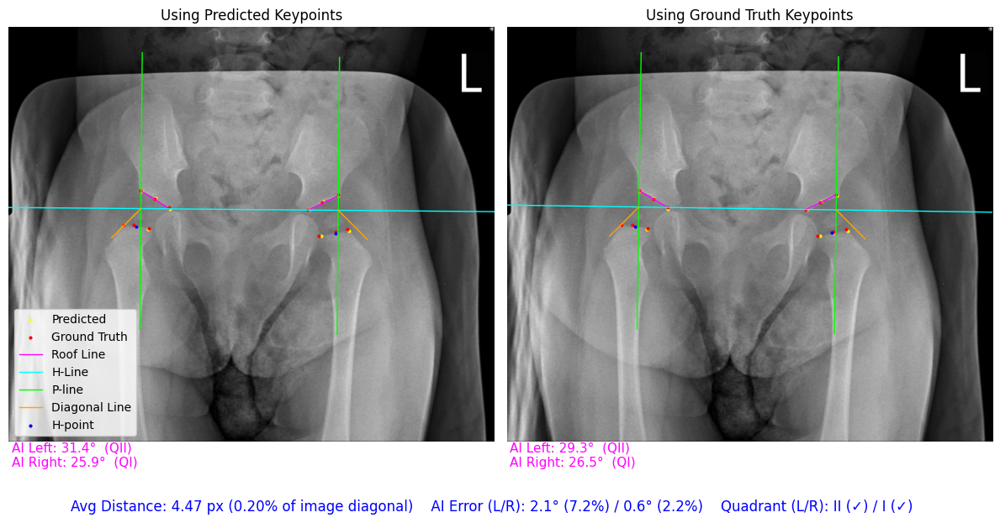
<br>
    <a href="https://app.codacy.com/gh/tana0101/Hip-Joint-Keypoint-Detection/dashboard?utm_source=gh&utm_medium=referral&utm_content=&utm_campaign=Badge_grade"></a>
    
    
    <a href="https://deepwiki.com/tana0101/Hip-Joint-Keypoint-Detection"></a>
    
    
</div>

## 📋Overview

本專案提出一套**基於深度學習的髖關節關鍵點偵測系統**，目標為輔助小兒髖關節發育不良（Developmental Dysplasia of the Hip, **DDH**）之量測與分級：  
(1) 自動偵測髖關節關鍵點，(2) 計算 **Acetabular Index (AI) angle**，(3) 進行 **IHDI 分類**。  
系統採用**由上而下（Top-down）的兩階段流程**：先以 **YOLO** 偵測/裁切髖關節區域，再以關鍵點模型進行單側（left/right）關鍵點偵測。

> **Research-only Notice**：本專案為資訊工程研究用途之原型系統，輸出結果不得直接作為臨床診斷依據。

## 📑Table of Contents

- [Introduction](#introduction)
- [Key Features](#key-features)
- [Dataset](#dataset)
- [Methodology](#methodology)
- [Installation](#installation)
- [Usage (One-fold)](#usage-onefold-training--evaluation)
- [Usage (K-Fold)](#usage-k-fold-cross-validation)
- [Results](#results)
- [References](#references)

## Introduction

小兒髖關節發育不良（DDH）是一種常見但容易被忽略的骨骼發育疾病，若未能及早診斷與介入，可能對孩童未來的行走能力與骨骼發育造成長期影響。

在臨床實務上，DDH 的診斷高度仰賴醫師對 X 光影像的人工判讀與量測，過程具有一定的主觀性，且在不同醫師或不同時間點之間，容易產生量測差異。

近年來，深度學習在醫學影像分析領域展現出卓越的表現，特別適合應用於關鍵點偵測、角度量測與疾病分級等任務。本專案即利用深度學習模型，自動偵測髖關節關鍵點，進一步輔助臨床進行 DDH 相關指標的計算與分類。

## ✨Key Features

- 📍 **髖關節關鍵點偵測**：自動預測髖關節關鍵點座標。
- 📐 **臨床指標量測**：支援 Acetabular Index (AI) Angle 計算與 IHDI 分類。
- 🏗️ **多模型架構支援**：可彈性選擇不同 Backbone（如 ConvNeXt、HRNet、EfficientNet 等）。
- 🎯 **多種 Head 設計**：支援 Direct Regression 與 SimCC 系列等不同關鍵點預測策略。
- 🧩 **模組化設計**：方便進行模型替換、實驗比較與擴充研究。

## 💾Dataset

- 資料存放於 `dataset/` 目錄中。
- 標註程式位於 `Keypoint-Annotation-Tool/` 目錄中。
🚧 **資料集下載與整理流程將於後續補充** 🚧

### 🏥xray_IHDI（主要實驗資料集）
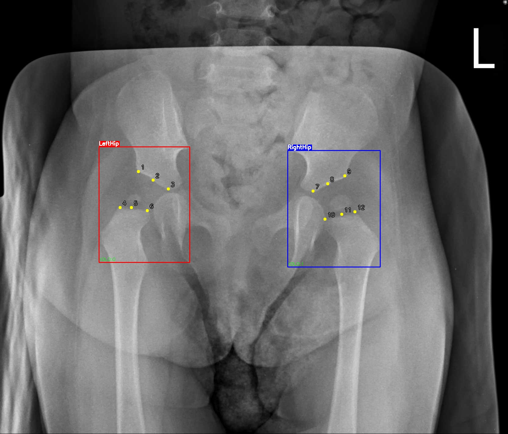

本研究採用回溯性資料，收集來自成大醫院於 2015/01/01 至 2025/01/19 期間，4 歲以下嬰幼兒之髖部 X 光影像。原始納入 622 份影像，經排除異常值後保留 557 張。每張影像由臨床專業醫師手動標註 **12 個關鍵點**，並提供 LeftHip / RightHip 物件標籤供偵測階段訓練。

- 影像標註：每張影像對應一個 .csv，格式：
```
"(x1,y1)","(x2,y2)",...,"(x12,y12)"
```
- 備註：基於醫療隱私與資料保護規範，無法公開釋出。

<hr>

### 🌍MTDDH（公開資料集）
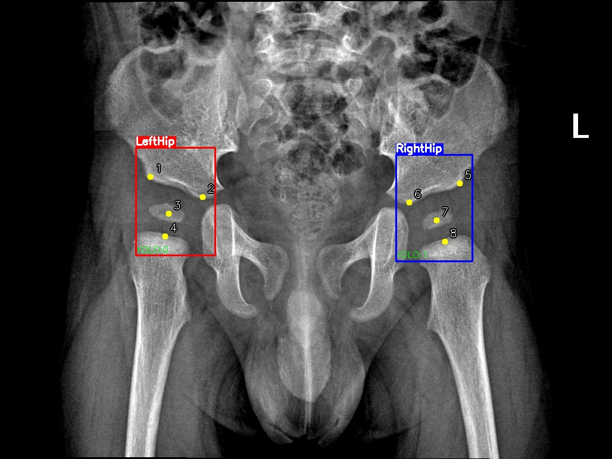

- 資料來源：[open-hip-dysplasia](https://github.com/radoss-org/open-hip-dysplasia.git)
- 資料量：1666 張髖關節 X 光影像（已排除異常值）
- 標註內容：
  - **8 個關鍵點**
  - LeftHip / RightHip 物件標籤

<hr>

### 📊資料統計分佈

**Acetabular Index (AI) 分佈**
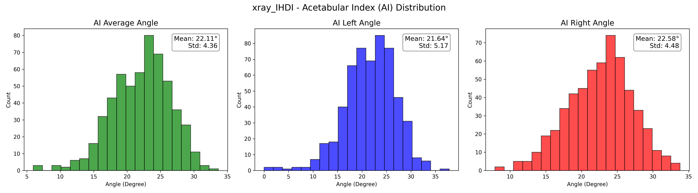
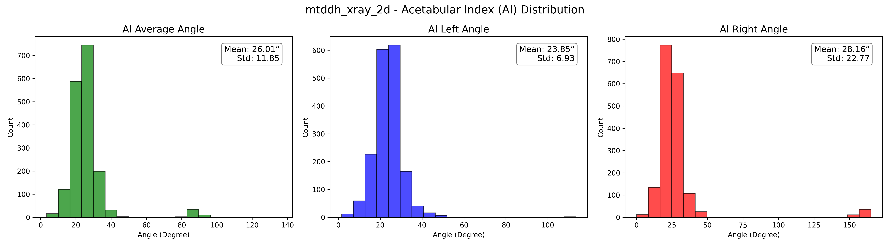

**IHDI 分類分佈**
<div style="display: flex; justify-content: space-between; gap: 10px;">
  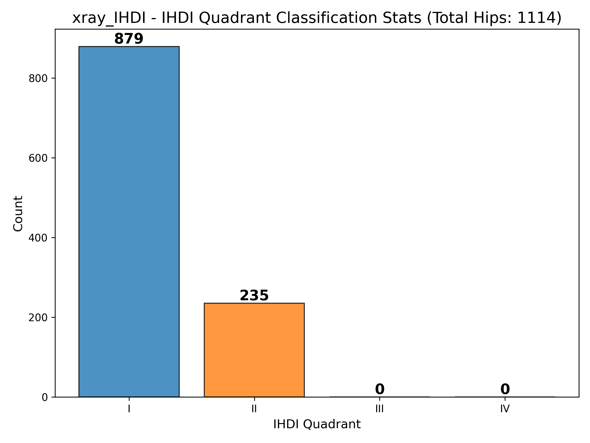
  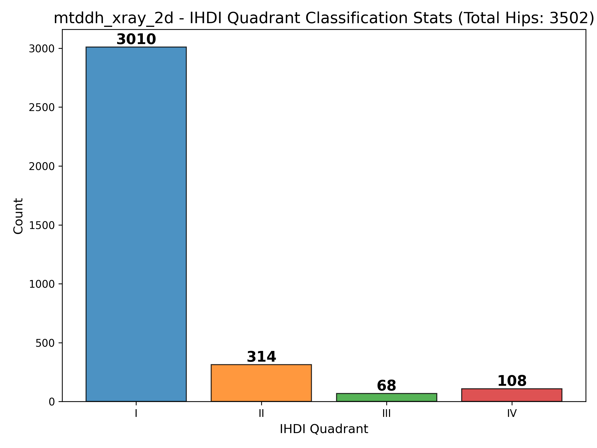
</div>

## 🛠️Methodology

本專案採用由上而下（Top-down）的兩階段關鍵點偵測流程：
1. **🔍 物件偵測與單邊裁切**：以 YOLO 偵測 LeftHip / RightHip，裁切 ROI（降低背景干擾）。
2. **🧠 單側關鍵點偵測**：對裁切後單側 hip ROI 進行關鍵點偵測（多 Backbone / Head 研究比較）。

### Head Architecture

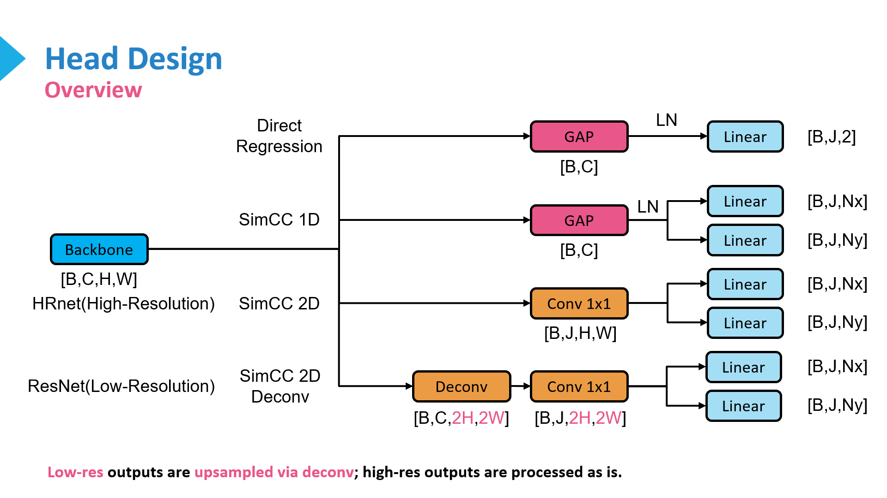

本專案支援多種關鍵點 Head 設計，以因應不同模型特性與實驗需求：

- **SimCC 2D / SimCC 2D Deconv**：
官方 SimCC 系列，將座標回歸轉為 x/y 一維分類分佈，透過 soft-argmax 取得座標。
- **SimCC 1D（自訂變體）**：
以 Global Average Pooling 壓縮特徵圖，使用全連接層預測 x/y 分佈以降低複雜度。
- **Direct Regression**：
以全連接層直接回歸 (x, y) 座標。

### Backbone Architecture

目前支援的 Backbone 架構如下：

- ConvNeXtV1  
  - `ConvNeXtSmallCustom`
- ConvNeXtV1 + Feature Pyramid Network（多尺度特徵）  
  - `ConvNeXtSmallMS`
- HRNet  
  - `HRNetW32Custom`
  - `HRNetW48Custom`

其中 `Custom` 結尾代表本專案基於官方實作進行修改與優化，以更符合髖關節關鍵點偵測任務的需求。

🚧 **其他 Backbone（如 EfficientNet、InceptionNeXt 等）目前仍在開發與測試中，以確保可與不同 Head 架構相容** 🚧

### Other Techniques

- **🔄 Data Augmentation**：Random Rotation / Random Translation
- **📉Loss Functions**
  - **Direct Regression (MSE Loss)**
  - **SimCC Series (KL Divergence Loss)**
- **⚙️ Optimizers**：AdamW
- **📈 LR Schedulers**：Cosine Annealing + Warmup

## 📂Project Structure

```text
Hip-Joint-Keypoint-Detection/
├── dataset/                        # 💾 資料集存放目錄
│   ├── xray_IHDI/                  # 主要實驗資料集 (Private)
│   └── mtddh/                      # 公開資料集 (Public)
├── datasets/                       # 資料集載入與處理模組
├── models/                         # 🧠 模型與 Head 的定義與實作
├── src/                            # 系統核心資源與圖片
│   └── img/                        # README 使用之展示圖片
├── utils/                          # 🛠️ 通用工具函式庫
├── weights/                        # 📥 訓練完成的模型權重存放區 (.pth)
├── logs/                           # 📝 訓練過程日誌與損失曲線圖
├── results/                        # 📊 統計結果輸出目錄
├── Keypoint-Annotation-Tool/       # 🖊️ 關鍵點標註工具
├── Hip-Joint-Keypoint-Detection-Tool/ # 🖥️ 臨床輔助介面原型 (WIP)
├── train_yolo.py                   # [訓練] YOLO 物件偵測模型
├── train_hip_crop_keypoints.py     # [訓練] 單側髖關節關鍵點模型
├── predict_hip_crop_keypoints.py   # [推論] 執行完整的偵測與評估
├── split.py                        # [工具] 資料集分割 (Train/Val/Test)
├── kfold_split.py                  # [工具] K-Fold 資料集分割
├── kfold_train_yolo.py             # [K-Fold] YOLO 交叉驗證訓練
├── kfold_train_hip_crop_keypoints.py # [K-Fold] 關鍵點交叉驗證訓練
├── kfold_predict_hip_crop_keypoints.py # [K-Fold] 交叉驗證評估
├── requirements.txt                # 📦 專案依賴套件清單
├── README.md                       # 🇬🇧 英文說明文件
└── README_zh_TW.md                 # 🇹🇼 繁體中文說明文件
```

## 📦Installation

按照以下方式安裝所需的 Python 環境與套件：

### 使用 Conda 創建虛擬環境

1. 複製專案：
```
   git clone https://github.com/tana0101/Hip-Joint-Keypoint-Detection.git
   cd Hip-Joint-Keypoint-Detection
```
2. 創建並啟動 Conda 虛擬環境：
```
   conda create -n hip_joint_detection python=3.10
   conda activate hip_joint_detection
```
3. 安裝所需套件：
```
   pip install -r requirements.txt
```

### 使用一般 Python 環境

1. 複製專案：
```
   git clone https://github.com/tana0101/Hip-Joint-Keypoint-Detection.git
   cd Hip-Joint-Keypoint-Detection
```
2. 安裝所需套件：
```
   pip install -r requirements.txt
```

## 🚀Usage (One-fold): Training & Evaluation

### Data Preparation

本專案提供 MTDDH 資料集 作為示範用途。在分割資料集或訓練模型之前，請先執行自動化腳本以下載、清洗並轉換原始資料。

執行準備腳本： 此腳本會自動將資料集下載至 `dataset/mtddh_xray_2d`，並移除異常值、轉換標註格式以及生成視覺化驗證圖。
```
chmod +x prepare_MTDDH_dataset.sh
./prepare_MTDDH_dataset.sh
```

### Split Dataset

<details><summary><b>點擊展開指令說明</b></summary>

```
usage: split.py [-h] --dataset DATASET [--out OUT] [--train TRAIN] [--val VAL]
                [--test TEST] [--seed SEED]

Split dataset into train/val/test with multiple modalities and emit
Ultralytics data.yaml

options:
  -h, --help         show this help message and exit
  --dataset DATASET  Root directory of the dataset, e.g., dataset/xray_IHDI
  --out OUT          Output root directory (default: data)
  --train TRAIN      Train split ratio (default: 0.8)
  --val VAL          Validation split ratio (default: 0.1)
  --test TEST        Test split ratio (default: 0.1)
  --seed SEED        Random seed (default: 42)
```
</details>

常用指令範例：
```
python split.py --dataset dataset/mtddh_xray_2d --out data --train 0.8 --val 0.1 --test 0.1 --seed 42
```

將會分割出 `data/train`、`data/val`、`data/test` 三個子目錄，並產生物件偵測用的 `data/data.yaml` 檔案供後續訓練使用。

### Training

由於本專案採用兩階段，先使用 YOLO 偵測並裁切出髖關節區域，再進行單邊關鍵點偵測模型的訓練。

#### Step 1: Train YOLO Detector

常用指令範例：
```
python train_yolo.py \
  --model yolo26s.pt \
  --data data/data.yaml \
  --epochs 300 --imgsz 640 --batch 8 --device 0 \
  --project runs/train --name yolo26s --pretrained --seed 42 \
  --fliplr 0.0 --flipud 0.0 --degrees 5.0 \
  --shear 0.0 --perspective 0.0 --mosaic 0.0 --mixup 0.0
```

⚠️注意：訓練完成後，請將最佳權重 `(runs/detect/runs/exp_name/weights/best.pt)` 移動並重新命名至 `weights/` 資料夾（例如命名為 `yolo26s.pt`），以配合後續推論步驟。

#### Step 2: Train Keypoint Detector

<details><summary><b>點擊展開指令說明</b></summary>

```
usage: train_hip_crop_keypoints.py [-h] --data_dir DATA_DIR --model_name
                                   MODEL_NAME [--epochs EPOCHS]
                                   [--input_size INPUT_SIZE]
                                   [--learning_rate LEARNING_RATE]
                                   [--batch_size BATCH_SIZE]
                                   [--side {left,right}] [--mirror]
                                   [--head_type {direct_regression,simcc_1d,simcc_2d,simcc_2d_deconv}]
                                   [--split_ratio SPLIT_RATIO] [--sigma SIGMA]

options:
  -h, --help            show this help message and exit
  --data_dir DATA_DIR   Path to the dataset directory
  --model_name MODEL_NAME
                        Model name: 'efficientnet', 'resnet', or 'vgg'
  --epochs EPOCHS       Number of training epochs
  --input_size INPUT_SIZE
                        Input image size for the model
  --learning_rate LEARNING_RATE
                        Learning rate
  --batch_size BATCH_SIZE
                        Number of samples per batch
  --side {left,right}   Side to train on: 'left' or 'right'
  --mirror              Whether to include mirrored data from the opposite
                        side
  --head_type {direct_regression,simcc_1d,simcc_2d,simcc_2d_deconv}
                        Type of model head to use
  --split_ratio SPLIT_RATIO
                        SimCC split ratio for label encoding
  --sigma SIGMA         Sigma for SimCC label encoding
```

</details>

常用指令範例：
```
python train_hip_crop_keypoints.py --data_dir data --model_name convnext_small_custom --input_size 224 --epochs 200 --learning_rate 0.0001 --batch_size 32 --side left --mirror --head_type simcc_2d --split_ratio 3.0 --sigma 7.0
```

訓練結果：
- 最佳模型會存為：
```
weights/{model_name}_{head_type}_{split_ratio}_{sigma}_{side}_{mirror}_{input_size}_{epochs}_{learning_rate}_{batch_size}_best.pth
```
範例：convnext_small_custom_simcc_2d_sr3.0_sigma7.0_cropleft_mirror_224_200_0.0001_32_best.pth 
- 訓練過程圖表會存為：
```
logs/{model_name}_{head_type}_{split_ratio}_{sigma}_{side}_{mirror}_{input_size}_{epochs}_{learning_rate}_{batch_size}_training_plot.png
```
範例：convnext_small_custom_simcc_2d_sr3.0_sigma7.0_cropleft_mirror_224_200_0.0001_32_training_plot.png
- 訓練日誌會存為：
```
logs/{model_name}_{head_type}_{split_ratio}_{sigma}_{side}_{mirror}_{input_size}_{epochs}_{learning_rate}_{batch_size}_training_log.txt
```
範例：convnext_small_custom_simcc_2d_sr3.0_sigma7.0_cropleft_mirror_224_200_0.0001_32_training_log.txt

### Evaluation

<details><summary><b>點擊展開指令說明</b></summary>

```
usage: predict_hip_crop_keypoints.py [-h] --model_name MODEL_NAME
                                     [--kp_left_path KP_LEFT_PATH]
                                     [--kp_right_path KP_RIGHT_PATH]
                                     --yolo_weights YOLO_WEIGHTS --data DATA
                                     [--output_dir OUTPUT_DIR]
                                     [--fold_index FOLD_INDEX]

options:
  -h, --help            show this help message and exit
  --model_name MODEL_NAME
                        efficientnet | resnet | vgg
  --kp_left_path KP_LEFT_PATH
                        left-side KP model (.pth)
  --kp_right_path KP_RIGHT_PATH
                        right-side KP model (.pth)
  --yolo_weights YOLO_WEIGHTS
                        YOLO weights (e.g., best.pt)
  --data DATA           data directory
  --output_dir OUTPUT_DIR
                        output directory
  --fold_index FOLD_INDEX
                        fold index for k-fold cross-validation (optional)
```

</details>

常用指令範例：
```
python3 predict_hip_crop_keypoints.py --model_name convnext_small_custom --kp_left_path weights/convnext_small_custom_simcc_2d_sr3.0_sigma7.0_cropleft_mirror_224_200_0.0001_32_best.pth --yolo_weights weights/yolo26s.pt --data data/test --output_dir results
```

統計結果會存於 `{output_dir}` 目錄中。
⚠️注意：請確保物件偵測權重（yolo_weights）與關鍵點權重（kp_path）皆已訓練完成並存在對應路徑。

## 🔄Usage (K-Fold Cross Validation)

### Split Dataset

<details><summary><b>點擊展開指令說明</b></summary>

```
usage: kfold_split.py [-h] --src SRC --dst DST [--k K] [--seed SEED]
                      [--overwrite]

K-fold split for object detection and keypoint datasets

options:
  -h, --help   show this help message and exit
  --src SRC    Source directory containing images/, annotations/, detections/, yolo_labels/
  --dst DST    Destination directory where fold1..foldK and data_fold{i}.yaml will be created
  --k K        Number of folds
  --seed SEED  Random seed for shuffling
  --overwrite  If the destination directory exists, delete it before creating new folds
```

</details>

常用指令範例：
```
python kfold_split.py \
  --src dataset/mtddh_xray_2d \
  --dst data \
  --k 5 \
  --seed 42 \
  --overwrite
```

### Training

#### Step 1: Train YOLO Detector

常用指令範例：
```
python kfold_train_yolo.py \
  --model yolo26s.pt \
  --data_tpl data/data_fold{fold}.yaml \
  --k 5 \
  --epochs 300 --imgsz 640 --batch 8 --device 0 \
  --project runs/train --name yolo26s_kfold --pretrained --seed 42 \
  --fliplr 0.0 --flipud 0.0 --degrees 5.0 \
  --shear 0.0 --perspective 0.0 --mosaic 0.0 --mixup 0.0
```
⚠️注意：訓練完成後，請將各 Fold 的最佳權重 `(runs/detect/runs/yolo26s_kfold_fold{fold}/weights/best.pt)` 移動並重新命名至 `weights/` 資料夾（例如命名為 `yolo26s_fold{i}.pt`），以配合後續推論步驟。

#### Step 2: Train Keypoint Detector

<details><summary><b>點擊展開指令說明</b></summary>

```
usage: kfold_train_hip_crop_keypoints.py [-h] --data_root DATA_ROOT [--k K]
                                         [--mode {outer_inner,val_as_test}]
                                         [--inner_val_ratio INNER_VAL_RATIO]
                                         [--inner_seed INNER_SEED] [--copy]
                                         --model_name MODEL_NAME
                                         [--epochs EPOCHS]
                                         [--input_size INPUT_SIZE]
                                         [--learning_rate LEARNING_RATE]
                                         [--batch_size BATCH_SIZE]
                                         [--side {left,right}] [--mirror]
                                         [--head_type {direct_regression,simcc_1d,simcc_2d,simcc_2d_deconv}]
                                         [--split_ratio SPLIT_RATIO]
                                         [--sigma SIGMA]

K-fold training for hip crop keypoints.

options:
  -h, --help            show this help message and exit
  --data_root DATA_ROOT
                        包含 fold1..foldK 的資料夾，例如 data 或
                        dataset/xray_IHDI_kfold
  --k K                 fold 數量
  --mode {outer_inner,val_as_test}
                        outer_inner = Outer K-fold + Inner split; val_as_test
                        = 單層 K-fold，val 同時也是之後的 test fold
  --inner_val_ratio INNER_VAL_RATIO
                        在 outer_inner 模式下，Train pool 裡用多少比例做 inner validation
  --inner_seed INNER_SEED
                        在 outer_inner 模式下，inner split 的亂數種子
  --copy                預設用 symlink 建 tmp/train,val；加這個就改成實際複製檔案（較耗空間）
  --model_name MODEL_NAME
                        Model name: 'efficientnet', 'resnet', 'vgg',
                        'convnext' 等
  --epochs EPOCHS
  --input_size INPUT_SIZE
  --learning_rate LEARNING_RATE
  --batch_size BATCH_SIZE
  --side {left,right}
  --mirror
  --head_type {direct_regression,simcc_1d,simcc_2d,simcc_2d_deconv}
  --split_ratio SPLIT_RATIO
                        SimCC 的 sr 參數，用在 head_type 為 simcc* 時
  --sigma SIGMA         SimCC label encoding 的 sigma
```

</details>

常用指令範例：
```
python kfold_train_hip_crop_keypoints.py \
  --data_root data \
  --k 5 \
  --mode outer_inner \
  --inner_val_ratio 0.1 \
  --inner_seed 42 \
  --model_name convnext_small_custom \
  --input_size 224 \
  --epochs 200 \
  --learning_rate 0.0001 \
  --batch_size 16 \
  --side left \
  --mirror \
  --head_type simcc_2d \
  --split_ratio 3.0 \
  --sigma 7.0
```

訓練結果會存於 `weights/` 目錄中，檔名格式如下：
```
{model_name}_{head_type}_sr{split_ratio}_sigma{sigma}_crop{side}_{mirror}_{input_size}_{epochs}_{learning_rate}_{batch_size}_fold{fold}_best.pth
```

⚠️注意：請確保 data_root 目錄中已包含 k-fold 分割後的資料夾（fold1..foldK）與對應的 data_fold{i}.yaml 檔案。

### Evaluation

<details><summary><b>點擊展開指令說明</b></summary>

```
usage: kfold_predict_hip_crop_keypoints.py [-h] --model_name MODEL_NAME
                                           [--kp_left_tpl KP_LEFT_TPL]
                                           [--kp_right_tpl KP_RIGHT_TPL]
                                           --yolo_weights YOLO_WEIGHTS
                                           --data_root DATA_ROOT [--k K]
                                           [--output_root OUTPUT_ROOT]

K-fold test for hip crop keypoints.

options:
  -h, --help            show this help message and exit
  --model_name MODEL_NAME
                        efficientnet | resnet | vgg | convnext ...
  --kp_left_tpl KP_LEFT_TPL
                        左側 KP model 路徑模板，例如:
                        'weights/convnext_left_fold{fold}_best.pth'，會用
                        .format(fold=i) 產生每個 fold 的路徑。
  --kp_right_tpl KP_RIGHT_TPL
                        右側 KP model 路徑模板，可留空。
  --yolo_weights YOLO_WEIGHTS
                        YOLO weights (e.g., weights/yolo12s_fold{fold}.pt)
  --data_root DATA_ROOT
                        包含 fold1, fold2, ... 的資料夾，例如 data 或
                        dataset/xray_IHDI_kfold
  --k K                 fold 數量
  --output_root OUTPUT_ROOT
                        每個 fold 的輸出根目錄（下層會自動建立 fold1, fold2, ...）
```

</details>

常用指令範例：
```
python kfold_predict_hip_crop_keypoints.py \
  --model_name convnext_small_custom \
  --kp_left_tpl "weights/convnext_small_custom_simcc_2d_sr3.0_sigma7.0_cropleft_mirror_224_200_0.0001_16_fold{fold}_best.pth" \
  --yolo_weights weights/yolo26s_fold{fold}.pt \
  --data_root data \
  --k 5 \
  --output_root results_kfold
```

統計結果會存於 `{output_root}/{name}/fold{i}` 目錄以及`{output_root}/{name}/summary` 資料夾中
⚠️注意：請確保物件偵測權重（yolo_weights）與關鍵點權重（kp_path）皆已訓練完成並存在對應路徑。

## 🏆Results

不同 Head 的實驗結果：
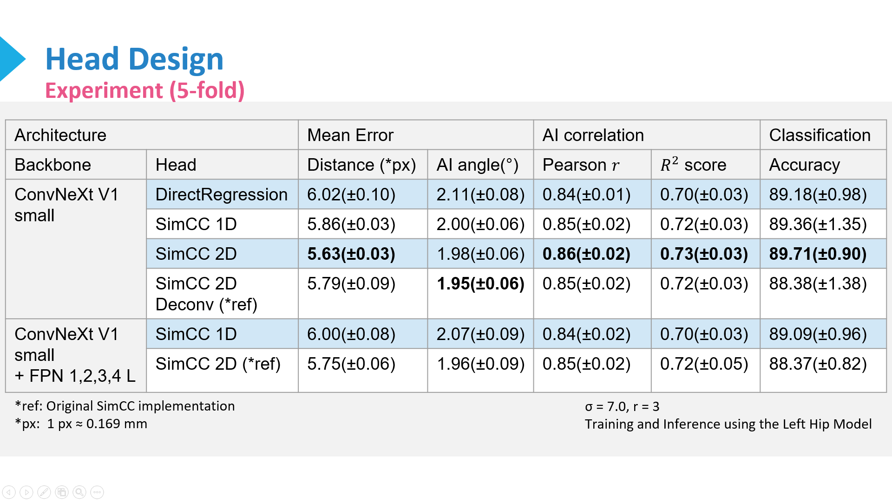

使用 ConvNeXtSmallCustom + SimCC 2D 的模型在 xray_IHDI 資料集上進行 5-fold 交叉驗證的結果如下：

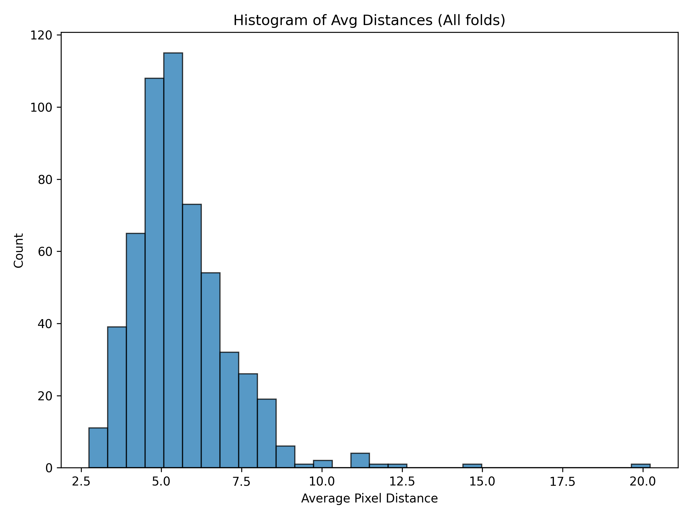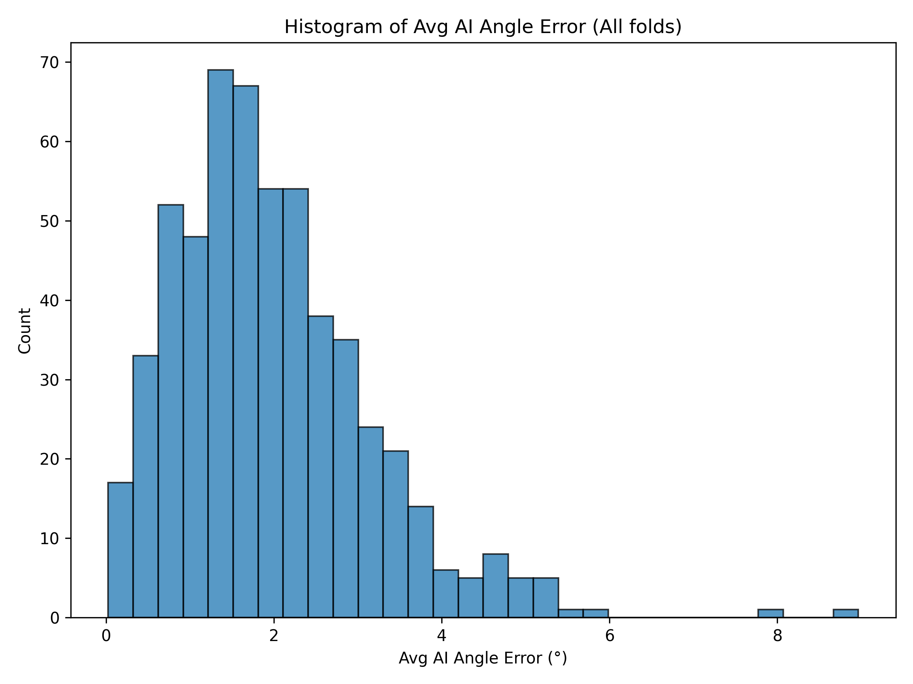
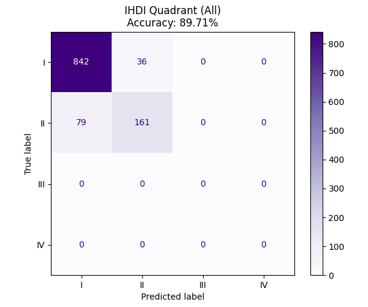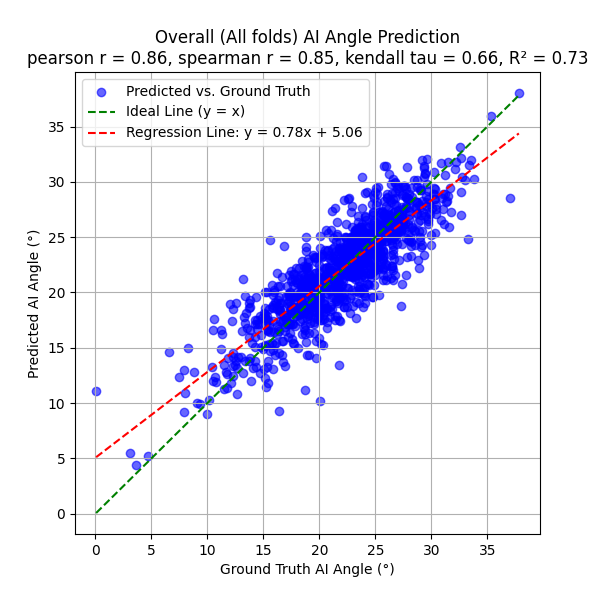

## ⚡Inference(WIP)

🚧臨床使用的介面正在開發中🚧
位於 `Hip-Joint-Keypoint-Detection-Tool/` 目錄下的程式碼為單階段關鍵點偵測系統的初步介面，僅供研究參考。

## ⚠️Disclaimer

> **Research Use Only**
> 本系統僅供學術研究與技術交流使用，**並非醫療器材**。
> 本專案之輸出結果不得作為臨床診斷、醫療決策或治療依據。
> 本軟體按「原樣」提供，不提供任何形式的明示或默示擔保，包括但不限於適銷性、特定用途適用性和不侵權的擔保。

## 📢Project Note

基於目前的研究進度與合作考量，本儲存庫 (Repository) 暫不公開核心演算法與部分關鍵技術細節。
若您對本專案的完整技術細節有興趣，或有意進行學術/商業合作，歡迎透過 Issue 討論或直接聯絡作者。

## ⚖️License

本專案採用 **GNU Affero General Public License v3.0 (AGPL-3.0)** 授權發布。
詳情請參閱 [LICENSE](LICENSE) 檔案。

### Dependencies & Acknowledgements

本專案基於多個優秀的開源專案構建，使用者在使用、分發或修改本專案時，必須同時遵守以下原始專案的授權規範。我們在此誠摯感謝各位作者的貢獻：

#### 1. 🛑核心限制性組件 (Restrictive Components)
以下組件對本專案的授權範圍有直接影響，請務必注意：

* **[Ultralytics YOLO](https://docs.ultralytics.com/)** (AGPL-3.0)
    * **影響**：由於本專案依賴 YOLO 進行核心訓練與推論，因此整體專案繼承 AGPL-3.0 規範。若您將本專案（或其修改版本）作為網路服務提供或公開發布，您必須公開您的原始碼。
* **[ConvNeXt V2](https://github.com/facebookresearch/ConvNeXt-V2)** (Meta Research)
    * **代碼**：MIT License。
    * **預訓練權重**：**CC-BY-NC 4.0 (僅限非商業用途)**。
    * **⚠️注意**：若您載入了 ConvNeXt V2 的官方預訓練權重，本專案將被限制為僅供學術研究或非商業用途。
* **[MambaVision](https://github.com/NVlabs/MambaVision)** (NVIDIA)
    * **授權**：NVIDIA Source Code License-NC (通常含有非商業用途限制，請參閱其 Repo 確認)。

#### 2. 🔓其他開源組件 (Other Open Source Components)
本專案亦引用了以下採用 MIT、Apache-2.0 或 BSD 等寬鬆授權的優秀專案：

* **[SimCC](https://github.com/leeyegy/SimCC)** (MIT)
* **[ConvNeXt V1](https://github.com/facebookresearch/ConvNeXt)** (MIT)
* **[EfficientNet](https://docs.pytorch.org/vision/main/models/efficientnet.html)** (BSD-3-Clause via TorchVision)
* **[InceptionNeXt](https://github.com/sail-sg/inceptionnext)** (Apache-2.0)
* **[HRNet (Bottom-Up)](https://github.com/HRNet/HRNet-Bottom-Up-Pose-Estimation)** (MIT)